# Hướng dẫn sử dụng module Biểu mẫu web

> Đưa khách hàng từ website vào CRM tự động. Tài liệu mô tả **chức năng chính** và cách dùng, dựa trên lần **chạy thật** ngày 06/10/2026 trên bản 7.4 (dữ liệu mẫu, website giả lập; không có dữ liệu khách thật). Có bản PDF đi kèm: `huong-dan-bieu-mau-web.pdf`.

## Tóm tắt nhanh

Biểu mẫu web là một form đăng ký (ví dụ “Đăng ký tư vấn”) mà bạn đặt lên website của công ty. Khi khách điền và bấm gửi, CRM **tự tạo một khách hàng tiềm năng**, **tự giao cho nhân viên** phụ trách và đưa khách về trang cảm ơn — không ai phải nhập tay.

```
1: Khách điền form trên website  →  2: CRM tự tạo khách hàng tiềm năng  →  3: Tự giao cho nhân viên  →  4: Khách thấy trang cảm ơn
```

### Bạn làm được những gì

- **Tạo form** trong vài phút: chọn mô-đun, các trường cần hỏi khách, trường nào bắt buộc (mục 2).
- **Gắn dữ liệu ẩn**: tự điền sẵn nguồn khách, dự án… mà khách không nhìn thấy (mục 2.2).
- **Giao lead** cố định cho một người, hoặc **chia luân phiên** cho nhiều người (mục 2.3, 6).
- **Nhận tệp** khách tải lên thành Tài liệu gắn vào hồ sơ (mục 2.4).
- **Lấy mã nhúng** dán vào website và **đưa khách về trang cảm ơn** (mục 3).
- Mọi khách từ form đều có nguồn tạo **WEBFORM** để dễ lọc, thống kê (mục 5).

### Ba điều cần biết trước khi bắt đầu

> 🔴 **1. Không bật “Captcha” của CRM** — Đã thử thật: khung captcha **không hiện** và form **vẫn gửi được** như thường, nên không chống được spam (mục 9).

> ⚠️ **2. Bỏ ô ẩn `__vtrftk` khi dán mã lên website** — Mã nhúng có kèm mã bảo mật gắn với phiên đăng nhập của quản trị viên. Không cần thiết và không nên đưa lên trang công khai (mục 3.2).

> ℹ️ **3. Muốn tạm ngừng nhận dữ liệu, hãy bỏ tick “Trạng thái”** — Đừng xoá biểu mẫu. Bỏ tick ô *Trạng thái* rồi Lưu: form còn trên website sẽ báo *Webform not found.* và **không tạo lead**. Tick lại là nhận tiếp, mã nhúng giữ nguyên (mục 7).

*Ảnh minh hoạ chụp trên bản thử nghiệm với dữ liệu mẫu và một website giả lập; không có dữ liệu khách thật.*

## 1. Biểu mẫu web là gì?

### 1.1 Mục đích

Khách vào website, để lại họ tên và số điện thoại. Nếu nhân viên phải chép thông tin đó vào CRM bằng tay thì chậm, dễ sót và dễ sai. Biểu mẫu web nối thẳng form trên website vào CRM để việc này diễn ra **tự động và tức thì**.

### 1.2 Ai làm gì?

| Vai trò | Việc cần làm |
|---|---|
| **Quản trị viên CRM** | Tạo biểu mẫu, chọn trường, chọn người nhận lead, lấy mã nhúng (mục 2, 3.1) |
| **Người làm website** | Dán mã nhúng vào trang, chỉnh giao diện, làm trang cảm ơn (mục 3.2, 3.3) |
| **Khách hàng** | Điền form trên website và bấm gửi (mục 4) |
| **CRM** | Tự tạo khách hàng tiềm năng, giao cho nhân viên (mục 5, 6) |
| **Nhân viên kinh doanh** | Nhận lead mới trong CRM và liên hệ khách |

### 1.3 Vào đâu để dùng?

Cài đặt (⚙) → **Tự động hoá** → **Biểu mẫu web**. Chỉ tài khoản **quản trị viên** dùng được. Biểu mẫu có thể tạo cho các mô-đun: Khách hàng tiềm năng, Khách hàng đã giao dịch, Chủ Đầu Tư, Đặt cọc - Giữ chỗ, Vé, Nhà cung cấp. Trên hệ thống thật hiện chỉ chọn được 4 mô-đun đầu tiên trừ *Chủ Đầu Tư* và *Nhà cung cấp* (hai mô-đun này đang tắt). Hướng dẫn này lấy **Khách hàng tiềm năng** làm ví dụ vì đây là trường hợp phổ biến nhất.

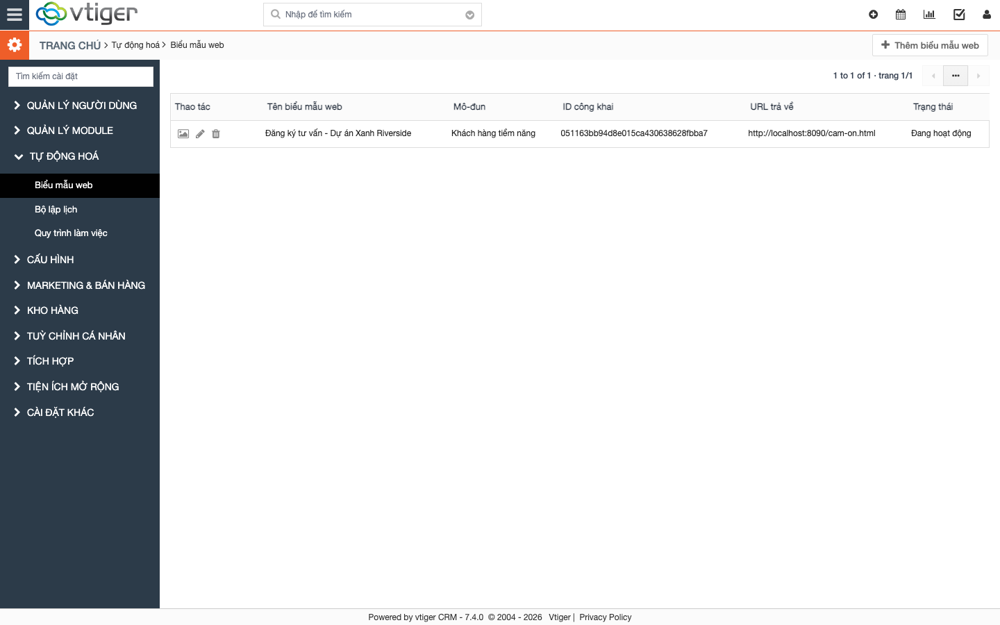
*Hình 1. Danh sách biểu mẫu web. Ba biểu tượng ở đầu mỗi dòng: *Hiển thị biểu mẫu*, *Sửa*, *Xoá*.*

## 2. Tạo biểu mẫu mới

*Dành cho quản trị viên*

**Mục đích:** khai báo form sẽ hỏi khách những gì và lead sẽ giao cho ai. Bấm **Thêm biểu mẫu web** ở góc trên bên phải.

> 💡 **Nhớ đổi mô-đun** — Màn hình tạo mới mặc định chọn mô-đun **Khách hàng đã giao dịch**. Với form đăng ký tư vấn, hãy đổi sang **Khách hàng tiềm năng** *trước khi* chọn trường (đổi mô-đun sẽ tải lại danh sách trường).

### 2.1 Thông tin chung

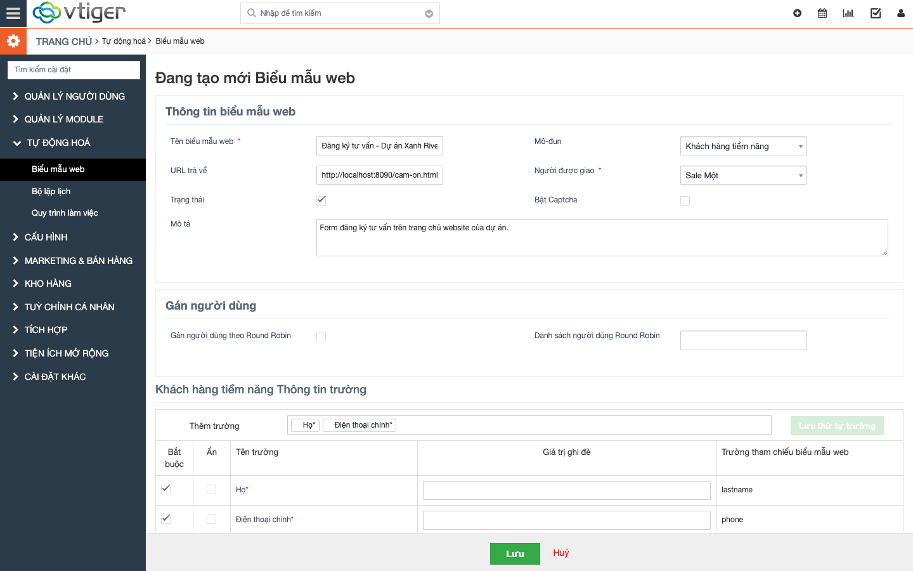
*Hình 2. Màn hình tạo mới: khối *Thông tin biểu mẫu web* và khối *Gán người dùng*.*

| Ô | Ý nghĩa / nên điền gì |
|---|---|
| **Tên biểu mẫu web** (*) | Tên để quản trị viên phân biệt, **không được trùng**. Nên đặt theo nơi đặt form, ví dụ *Đăng ký tư vấn - Dự án A* |
| **Mô-đun** | Bản ghi sẽ được tạo ở đâu khi khách gửi form. Thường là *Khách hàng tiềm năng* |
| **URL trả về** | Trang cảm ơn trên website mà khách được chuyển tới sau khi gửi. **Nên luôn điền** (xem mục 3.3 và 8) |
| **Người được giao** (*) | Người hoặc nhóm sở hữu lead. Bị bỏ qua nếu bật Round Robin |
| **Trạng thái** | Bật = đang nhận dữ liệu. Bỏ tick = tạm dừng (mục 7) |
| **Bật Captcha** | **Không nên bật** (mục 9) |
| **Mô tả** | Ghi chú nội bộ: form đặt ở trang nào, cho chiến dịch nào |

### 2.2 Chọn các trường trong form

Phía dưới là bảng **“… Thông tin trường”**. Bấm vào ô **Thêm trường** để chọn thêm trường cho form. Các trường bắt buộc của mô-đun luôn có sẵn (với Khách hàng tiềm năng là *Họ* và *Điện thoại chính*) và không bỏ được.

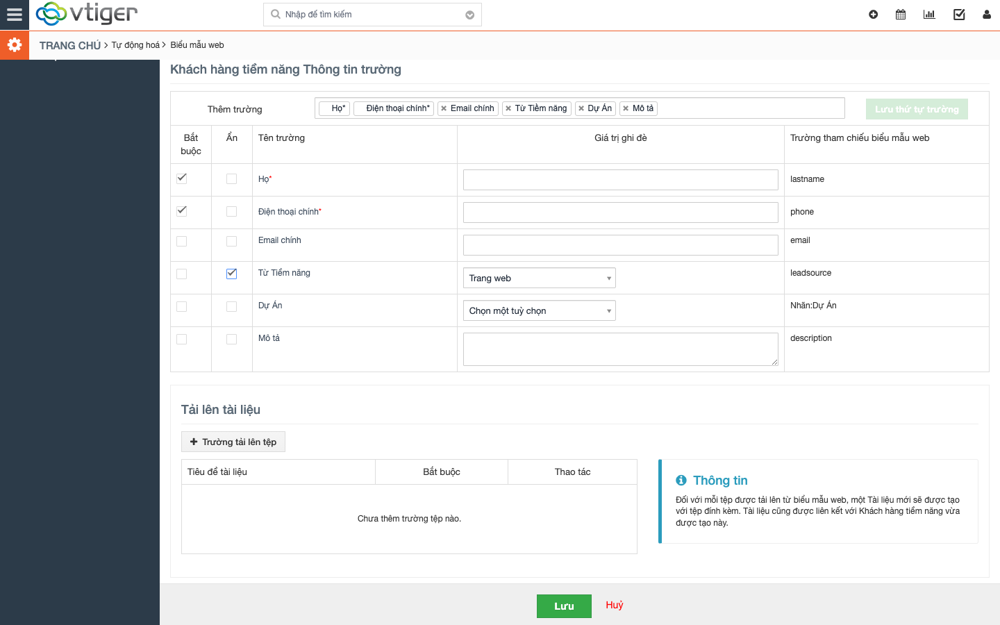
*Hình 3. Form có 6 trường. Trường *Từ Tiềm năng* được tích **Ẩn** kèm giá trị ghi đè *Trang web*.*

| Cột | Ý nghĩa |
|---|---|
| **Bắt buộc** | Khách phải điền mới gửi được. Trường bắt buộc của hệ thống đã tích sẵn |
| **Ẩn** | Không hiện cho khách nhưng vẫn gửi một giá trị cố định về CRM |
| **Tên trường** | Tên trường trong CRM |
| **Giá trị ghi đè** | Giá trị cố định. Có giá trị này thì CRM luôn dùng nó, bất kể khách nhập gì |
| **Trường tham chiếu biểu mẫu web** | Tên kỹ thuật của ô trong mã HTML — dành cho người làm website |

> 💡 **Mẹo: gắn nguồn khách mà khách không nhìn thấy** — Thêm trường *Từ Tiềm năng*, tích **Ẩn**, chọn **Giá trị ghi đè** = *Trang web*. Mọi lead từ form này sẽ tự mang nguồn đó. Cách làm tương tự cho trường dự án, chiến dịch…

**Ràng buộc hệ thống sẽ báo lỗi:** trường bắt buộc mà *không có giá trị ghi đè* thì không được tích Ẩn (khách sẽ không điền được); trường tham chiếu (chọn bản ghi khác) không được đặt Bắt buộc nếu không có giá trị ghi đè.

### 2.3 Giao lead cho ai?

- **Giao cố định:** chọn một người hoặc nhóm ở ô *Người được giao*. Mọi lead từ form này vào tay người đó.
- **Chia luân phiên (Round Robin):** tick *Gán người dùng theo Round Robin* và chọn danh sách người ở ô *Danh sách người dùng Round Robin*. Lead lần lượt được giao cho từng người trong danh sách, hết vòng thì quay lại người đầu (mục 6).


*Hình 4. Bật Round Robin với hai nhân viên Sale Một và Sale Hai.*

### 2.4 Nhận tệp khách tải lên

Muốn khách đính kèm tệp (ví dụ ảnh giấy tờ), kéo xuống khối **Tải lên tài liệu**, bấm **Trường tải lên tệp** và đặt **Tiêu đề tài liệu**. Tích *Bắt buộc* nếu cần. Mỗi tệp khách gửi sẽ thành một **Tài liệu** gắn vào khách hàng vừa được tạo. Giới hạn tối đa **5 trường tệp**, tổng dung lượng mỗi lần gửi tối đa **50 MB**.

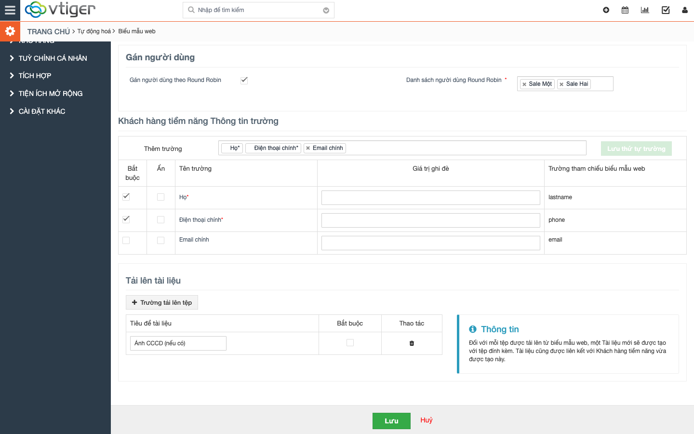
*Hình 5. Khối *Tải lên tài liệu* với một trường tệp “Ảnh CCCD (nếu có)”.*

### 2.5 Lưu và kiểm tra

Bấm **Lưu** (nút xanh dưới cùng). Trang chi tiết hiện đủ cấu hình; *URL gửi* và *ID công khai* do hệ thống tạo ra.

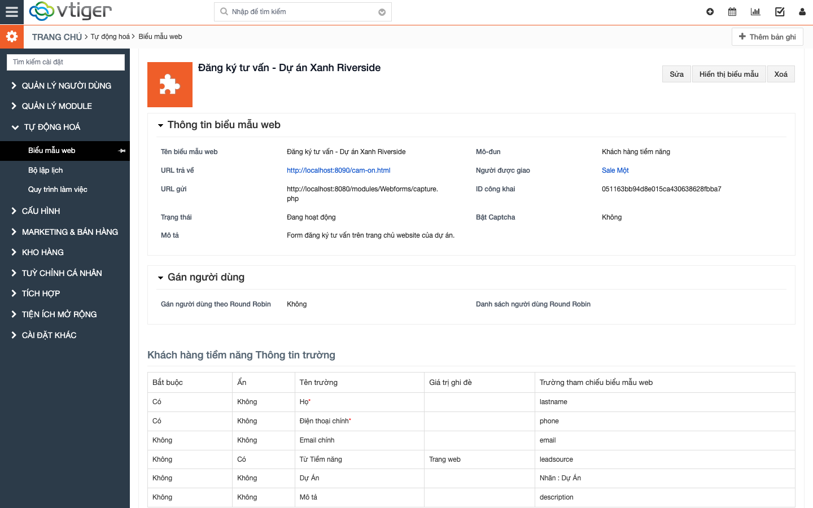
*Hình 6. Chi tiết biểu mẫu sau khi lưu. Nút *Hiển thị biểu mẫu* dùng để lấy mã nhúng.*

## 3. Lấy mã nhúng và đưa lên website

*Dành cho quản trị viên · Dành cho người làm website*

### 3.1 Lấy mã nhúng

Trong danh sách (hoặc trang chi tiết), bấm **Hiển thị biểu mẫu** (biểu tượng bức tranh). Hộp thoại hiện toàn bộ mã HTML của form. Bấm **Sao chép vào clipboard** rồi gửi cho người làm website.

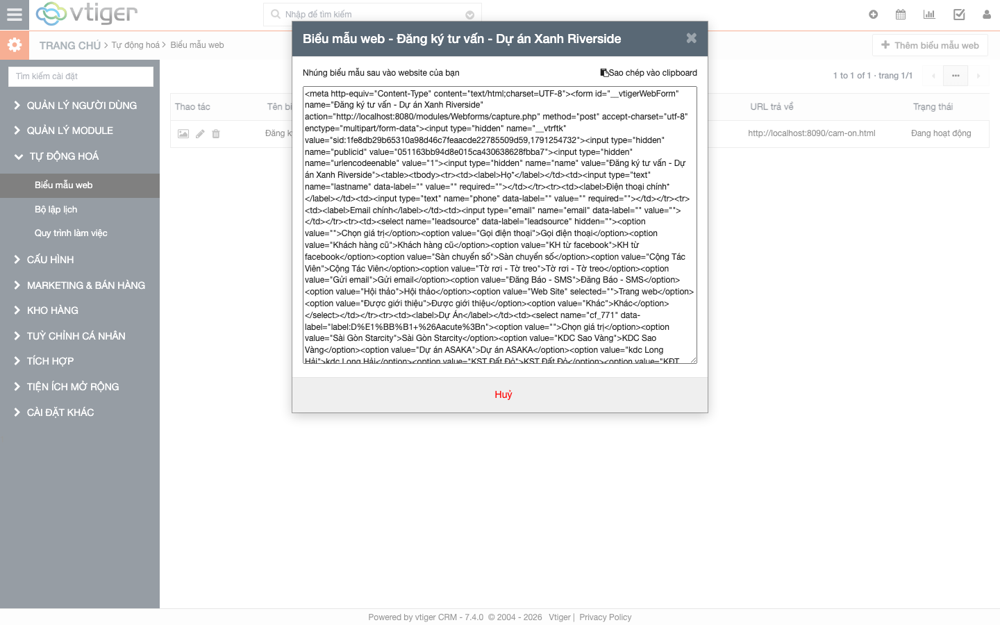
*Hình 7. Hộp thoại *Biểu mẫu web* chứa mã nhúng.*

### 3.2 Dán vào website — danh sách việc cần làm

- **Giữ nguyên** địa chỉ `action` (trỏ tới `…/modules/Webforms/capture.php`) và các ô ẩn `publicid`, `urlencodeenable`, `name`. Sửa hoặc xoá chúng là form ngừng hoạt động.
- **Xoá ô ẩn `__vtrftk`** trước khi đưa lên trang công khai. Đây là mã bảo mật gắn với phiên đăng nhập của quản trị viên, form **không cần** (đã thử: bỏ ô này form vẫn gửi bình thường).
- **Giữ nguyên thuộc tính `name`** của các ô nhập. Có thể đổi chữ nhãn: ví dụ nhãn *Họ** nên đổi thành *Họ và tên** cho khách dễ hiểu.
- Tuỳ chỉnh giao diện (màu sắc, khoảng cách) bằng CSS thoải mái. Mã nhúng chỉ là bảng HTML thô.
- Mã nhúng có kèm một đoạn `<script>` gán `window.onload`; nếu trang đã có mã khác dùng `window.onload` thì sẽ bị ghi đè. Người làm website cần lưu ý.
- **Mỗi lần sửa danh sách trường** của biểu mẫu, phải **lấy lại mã** và cập nhật lên website.
- Mã nhúng dùng địa chỉ CRM đã cấu hình hệ thống (`site_URL`). Nếu đổi tên miền CRM, phải lấy lại mã.

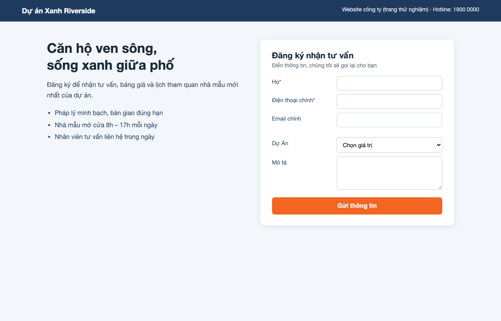
*Hình 8. Trang đăng ký giả lập của website sau khi dán mã (đã chỉnh CSS). Ô nguồn khách là trường ẩn nên không hiện.*

### 3.3 Trang cảm ơn và địa chỉ trả về

Sau khi nhận dữ liệu, CRM chuyển khách tới **URL trả về** kèm kết quả ở cuối địa chỉ. Người làm website có thể đọc kết quả này để hiện thông báo phù hợp:

| Tình huống | Địa chỉ khách được chuyển tới / nội dung khách thấy |
|---|---|
| Gửi thành công | `URL-trả-về?success=ok` |
| Có lỗi (ví dụ thiếu trường bắt buộc) | `URL-trả-về?error=thông báo lỗi` — thông báo lỗi bằng **tiếng Anh**, ví dụ *phone does not have a value* |
| Không điền URL trả về | Khách thấy dòng chữ thô `{"success":true,"result":"ok"}` (mục 8) |

## 4. Khách điền form trên website

*Dành cho nhân viên*

Khách điền thông tin và bấm **Gửi thông tin**. Các trường có dấu ***** là bắt buộc; trình duyệt sẽ nhắc nếu khách bỏ trống.

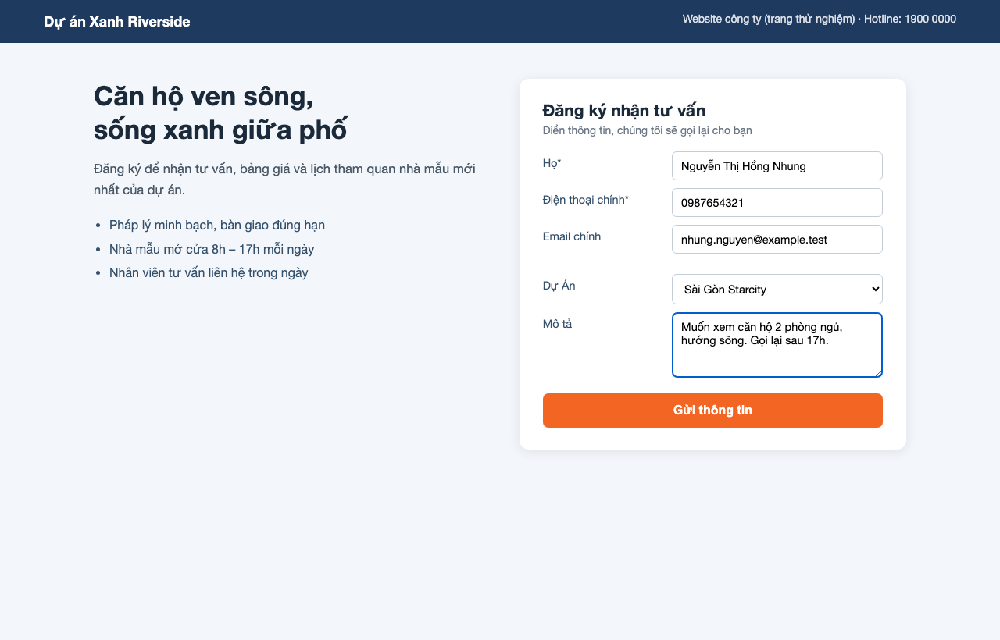
*Hình 9. Khách điền form (họ tên, số điện thoại, email, dự án quan tâm, ghi chú).*

Gửi xong, khách được chuyển ngay về trang cảm ơn đã khai báo ở *URL trả về*:

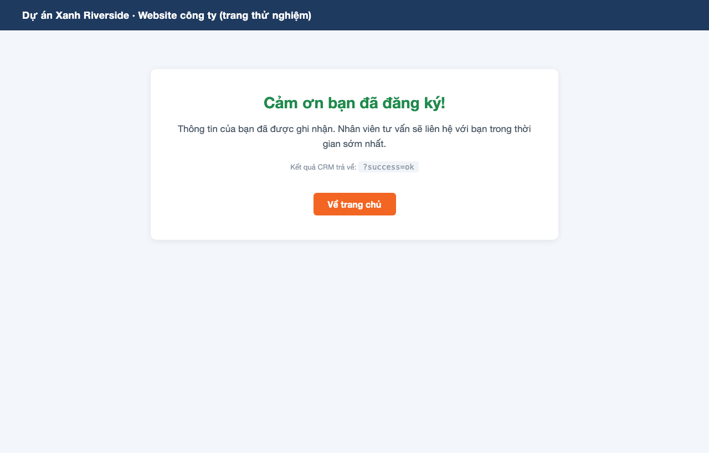
*Hình 10. Trang cảm ơn trên website. Dòng nhỏ “Kết quả CRM trả về: ?success=ok” chỉ để minh hoạ.*

## 5. Nhân viên nhận lead trong CRM

*Dành cho nhân viên*

Ngay sau khi khách gửi, một **khách hàng tiềm năng mới** xuất hiện ở đầu danh sách, đã được giao cho đúng người.

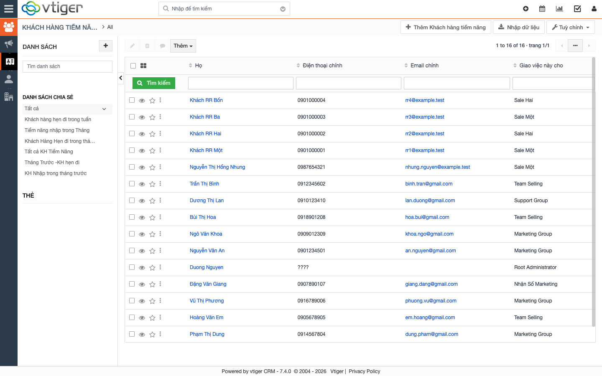
*Hình 11. Danh sách Khách hàng tiềm năng: các khách mới từ website nằm trên cùng, cột *Giao việc này cho* cho biết người phụ trách.*

Mở hồ sơ, tab **Chi tiết** cho thấy mọi thông tin form đã ghi nhận:

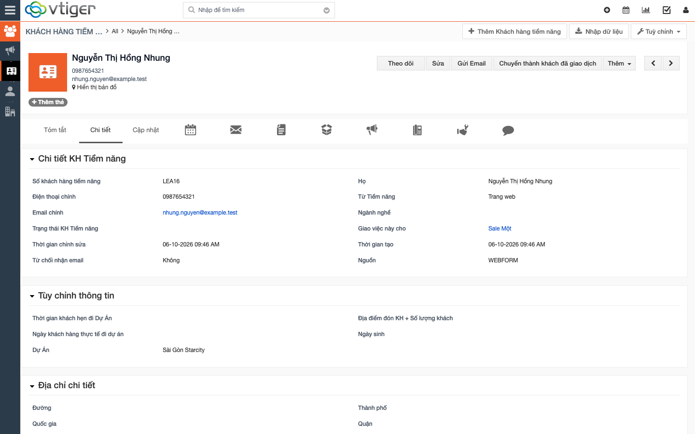
*Hình 12. Hồ sơ lead từ biểu mẫu: *Từ Tiềm năng = Trang web* (trường ẩn), *Giao việc cho = Sale Một*, **Nguồn = WEBFORM**, *Dự Án* do khách chọn.*

> 💡 **Lọc nhanh khách từ website** — Trường **Nguồn** luôn là **WEBFORM** với mọi khách do biểu mẫu web tạo, nên bạn có thể dùng để lọc danh sách hoặc làm báo cáo.

Nếu form có trường tệp, tệp khách gửi nằm ở khung **Tài liệu** của hồ sơ, tiêu đề lấy đúng theo tên trường bạn đặt:

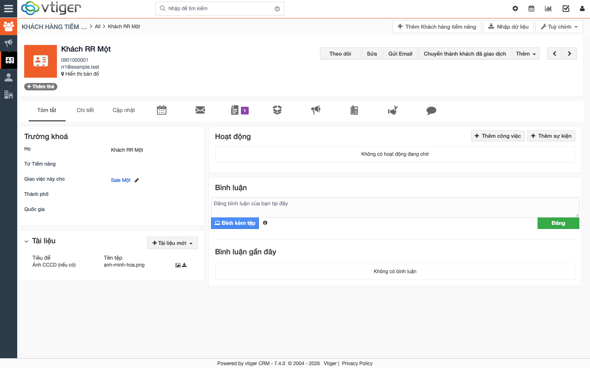
*Hình 13. Tài liệu “Ảnh CCCD (nếu có)” do khách tải lên, gắn vào hồ sơ.*

## 6. Chia lead luân phiên (Round Robin)

*Dành cho quản trị viên*

**Mục đích:** chia đều lead cho nhiều nhân viên, không ai bị dồn việc. Với form đã bật Round Robin, mỗi lần có khách gửi, CRM giao lead cho người **kế tiếp** trong danh sách; hết vòng thì quay về người đầu.

Đã chạy thật với 4 khách gửi liên tiếp vào form có hai nhân viên Sale Một và Sale Hai: lead được giao lần lượt **Sale Một → Sale Hai → Sale Một → Sale Hai** (xem cột *Giao việc này cho* ở Hình 11).

- Thứ tự luân phiên theo thứ tự người trong danh sách.
- Khi bật Round Robin, ô *Người được giao* không còn tác dụng.
- Danh sách có thể gồm cả người dùng và nhóm.

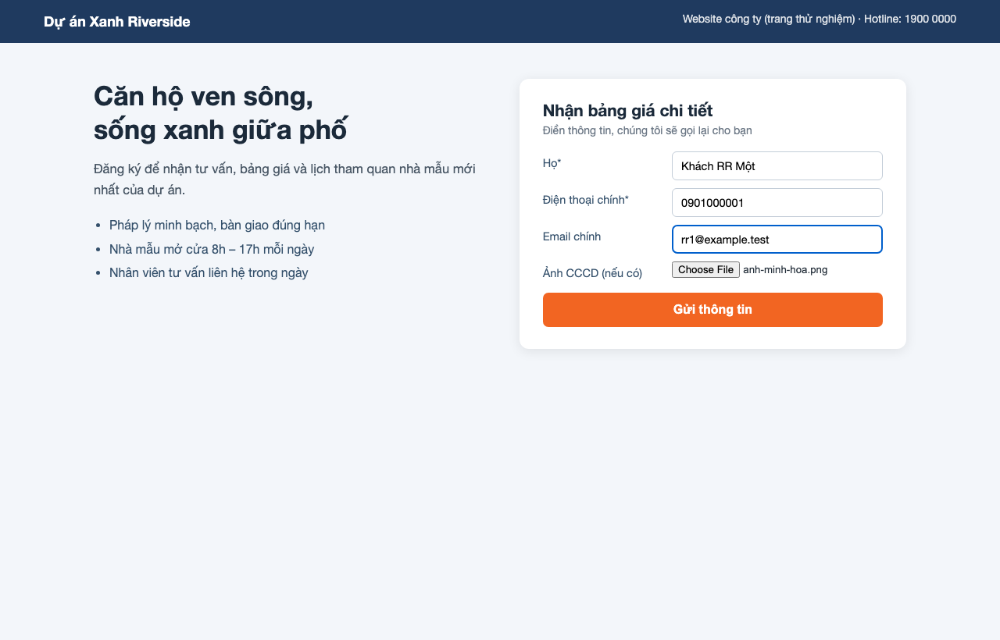
*Hình 14. Trang đăng ký của form Round Robin, có thêm ô chọn tệp đính kèm.*

## 7. Sửa, tạm dừng và xoá biểu mẫu

*Dành cho quản trị viên*

| Việc cần làm | Cách làm và lưu ý |
|---|---|
| **Sửa** | Bấm biểu tượng bút chì ở danh sách, hoặc nút *Sửa* ở trang chi tiết. Nếu đổi danh sách trường, phải **lấy lại mã nhúng** và cập nhật website |
| **Tạm dừng nhận dữ liệu** | Bấm biểu tượng bút chì, **bỏ tick ô *Trạng thái*** rồi Lưu. Danh sách hiện **Không hoạt động**. Từ lúc đó, form còn trên website sẽ nhận phản hồi *Webform not found.* và **không tạo lead** (khách thấy dòng JSON báo lỗi như ở mục 8). Muốn nhận lại, tick *Trạng thái* và Lưu: mã nhúng và ID công khai **không đổi** nên không phải sửa website |
| **Xoá** | Bấm biểu tượng thùng rác, xác nhận. Các lead đã tạo **không bị xoá**. Form còn nằm trên website sẽ báo lỗi *Webform not found.* |

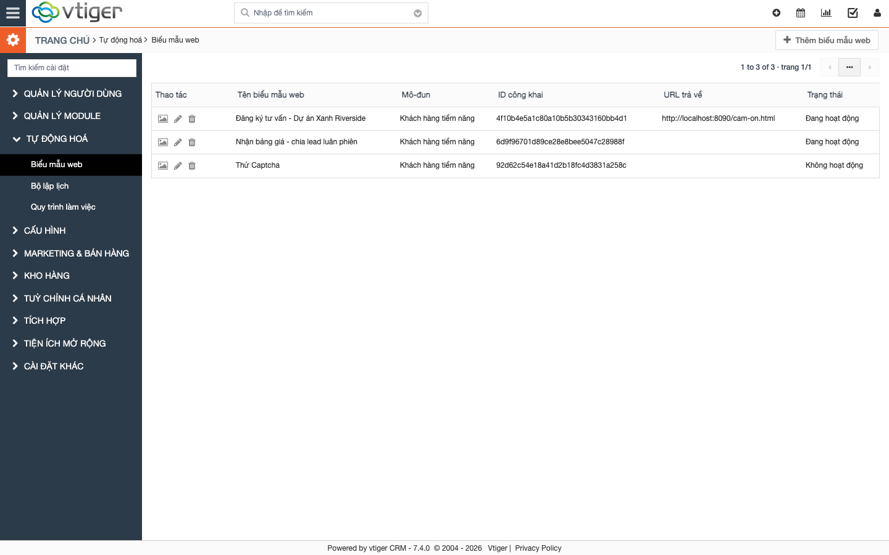
*Hình 15. Biểu mẫu *Thử Captcha* đã bỏ tick *Trạng thái*: cột *Trạng thái* hiện **Không hoạt động**.*

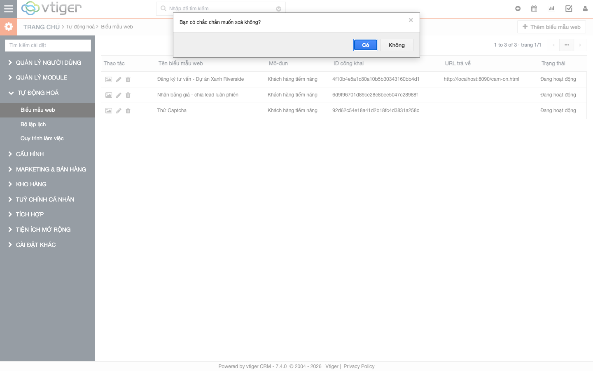
*Hình 16. Hộp xác nhận xoá, các nút *Có / Không* đã dịch sang tiếng Việt.*

## 8. Khi form báo lỗi hoặc không có trang cảm ơn

*Dành cho quản trị viên · Dành cho người làm website*

Nếu **không điền URL trả về**, sau khi gửi khách sẽ thấy nguyên một dòng JSON thô trên trình duyệt. Vì vậy hãy **luôn điền URL trả về**:

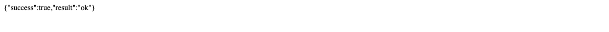
*Hình 17. Khách thấy dòng chữ thô khi biểu mẫu không có URL trả về.*

Khi có lỗi mà biểu mẫu **có** URL trả về, khách được chuyển tới trang đó kèm `?error=…`. Người làm website nên hiện thông báo thân thiện thay vì in nguyên văn lỗi tiếng Anh:

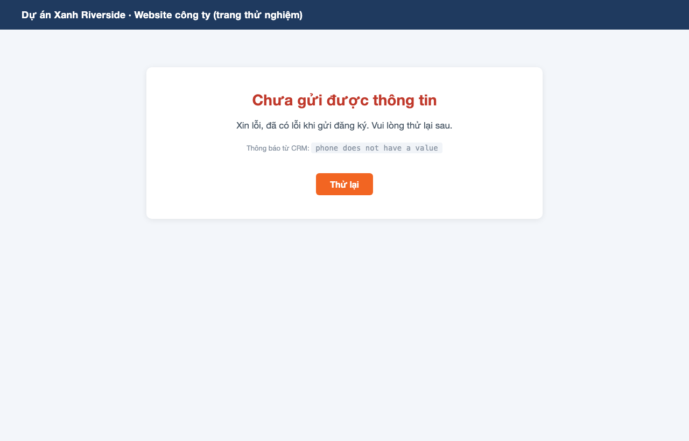
*Hình 18. Trang báo lỗi trên website (nhận `?error=phone does not have a value`).*

| Tình huống thử | Phản hồi của CRM |
|---|---|
| Thiếu trường bắt buộc (gửi thẳng, bỏ qua kiểm tra của trình duyệt) | Chuyển tới `URL-trả-về?error=phone does not have a value`. **Không tạo bản ghi** |
| Mã biểu mẫu (`publicid`) sai, thiếu, hoặc biểu mẫu đã bị xoá | Trả JSON `{"success":false,"error":{"message":"Webform not found."}}` (không chuyển hướng vì CRM không biết trang trả về). **Không tạo bản ghi** |

## 9. Captcha và chống spam

*Dành cho quản trị viên · Dành cho người làm website*

Ô **Bật Captcha** trong biểu mẫu **không có tác dụng**. Đã thử thật với một biểu mẫu bật Captcha:

- Mã nhúng gọi `http://www.google.com/recaptcha/api/challenge` — reCAPTCHA đời cũ với khoá cố định trong mã nguồn. Trình duyệt **chặn** yêu cầu này vì Google không còn trả đúng nội dung, nên **không có khung captcha nào hiện ra**.
- Khách bấm gửi: đoạn mã kiểm tra captcha báo lỗi JavaScript rồi để form gửi đi, và máy chủ CRM **không kiểm tra captcha**. Kết quả: lead **vẫn được tạo**.
- Tức là bật Captcha chỉ làm hỏng giao diện mà không chặn được spam.

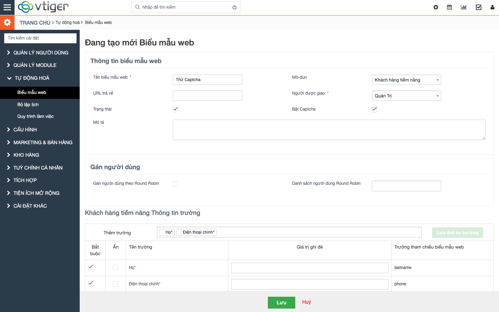
*Hình 19. Ô *Bật Captcha* được tick trong biểu mẫu thử.*

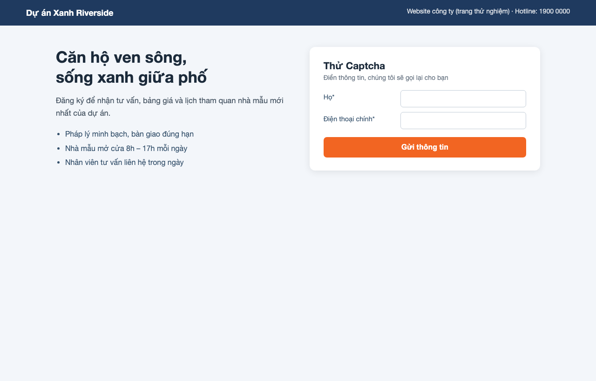
*Hình 20. Trang chứa biểu mẫu bật Captcha: không có khung captcha nào hiển thị.*

> ⚠️ **Cách chống spam nên dùng thay thế** — Chống spam ở phía website (người làm website xử lý): ô bẫy ẩn (honeypot), giới hạn số lần gửi từ một địa chỉ, hoặc dùng reCAPTCHA bản mới và kiểm tra ở máy chủ website trước khi chuyển dữ liệu sang CRM. Đồng thời nên dọn lead rác định kỳ.

## 10. Xử lý sự cố thường gặp

| Hiện tượng | Nguyên nhân thường gặp | Cách xử lý |
|---|---|---|
| Khách gửi form nhưng không thấy lead trong CRM | Website sai mã (`publicid`) hoặc sai địa chỉ `action`; biểu mẫu đã bị xoá; lead được giao cho nhân viên khác nên bạn không thấy | Lấy lại mã nhúng mới nhất; kiểm tra danh sách lead của người được giao |
| Khách thấy dòng chữ thô `{"success":true…}` | Chưa điền URL trả về | Điền URL trả về, Lưu (mục 3.3) |
| Khách thấy `Webform not found.` | Biểu mẫu đã xoá, đang ở trạng thái *Không hoạt động*, hoặc mã nhúng trên website cũ/sai | Xem cột *Trạng thái* trong danh sách, tick lại nếu cần; nếu đã xoá thì lấy mã mới (mục 3.1) và cập nhật website |
| Chuyển về trang với `?error=… does not have a value` | Thiếu một trường bắt buộc (ô bị xoá hoặc đổi tên trong HTML) | Đối chiếu với mã nhúng gốc; giữ nguyên thuộc tính `name` |
| Mọi lead dồn vào một người | Chưa bật Round Robin, hoặc danh sách chỉ có một người | Bật Round Robin và chọn nhiều người (mục 2.3) |
| Không chọn được *Chủ Đầu Tư*, *Nhà cung cấp* | Hai mô-đun này đang tắt trên hệ thống thật | Nhờ quản trị bật mô-đun nếu cần |
| Form trên website xấu, lệch | Mã nhúng là bảng HTML thô | Người làm website thêm CSS (mục 3.2) |

## 11. Lưu ý và hạn chế đã biết

| Vấn đề | Chi tiết |
|---|---|
| Captcha tích hợp không dùng được | Xem mục 9 |
| Mã nhúng chứa mã bảo mật `__vtrftk` | Cần xoá trước khi đăng lên website (mục 3.2) |
| Script nhúng gán `window.onload` và có cảnh báo tiếng Anh | Có thể ghi đè mã khác trên trang; chữ “The following fields are required…” là tiếng Anh nếu hiện ra |
| Thông báo lỗi trả về bằng tiếng Anh | Website nên tự hiện thông báo thân thiện bằng tiếng Việt |
| Mô-đun mặc định khi tạo mới là Khách hàng đã giao dịch | Nhớ đổi sang Khách hàng tiềm năng trước khi chọn trường |

### Những điều chưa được kiểm chứng

Tài liệu được biên soạn sau khi chạy thử thật. Các nội dung sau **chưa được thử**, nên hãy kiểm tra trước khi dùng cho công việc quan trọng:

- Biểu mẫu cho các mô-đun khác ngoài Khách hàng tiềm năng (Khách hàng đã giao dịch, Đặt cọc - Giữ chỗ, Vé).
- Các kiểu trường đặc biệt: ngày, số, nhiều lựa chọn, tiền tệ.
- Nhiều tệp cùng lúc, tệp gần 50 MB; form đặt trên website HTTPS gửi sang CRM.
- Cơ chế chống trùng lặp khi khách gửi hai lần.

## 12. Bảng tra thuật ngữ

| Thuật ngữ trên màn hình | Nghĩa |
|---|---|
| Biểu mẫu web (Webform) | Form đăng ký đặt trên website, gửi dữ liệu thẳng vào CRM |
| ID công khai (publicid) | Mã định danh của biểu mẫu nằm trong mã nhúng; cho CRM biết dữ liệu thuộc biểu mẫu nào |
| URL gửi | Địa chỉ nhận dữ liệu của CRM (`…/modules/Webforms/capture.php`) |
| URL trả về | Trang cảm ơn trên website, khách được chuyển tới sau khi gửi |
| Giá trị ghi đè | Giá trị cố định CRM luôn dùng cho một trường, bất kể khách nhập gì |
| Ẩn | Trường không hiện trên form nhưng vẫn gửi giá trị về CRM |
| Trường tham chiếu biểu mẫu web | Tên kỹ thuật của ô nhập trong mã HTML |
| Round Robin | Chia lead lần lượt cho từng người trong danh sách |
| Nguồn = WEBFORM | Dấu hiệu cho biết khách hàng được tạo tự động bởi biểu mẫu web |

*Tài liệu biên soạn ngày 06/10/2026 trên cơ sở lần chạy thử thật module Biểu mẫu web (vtiger CRM 7.4).*

