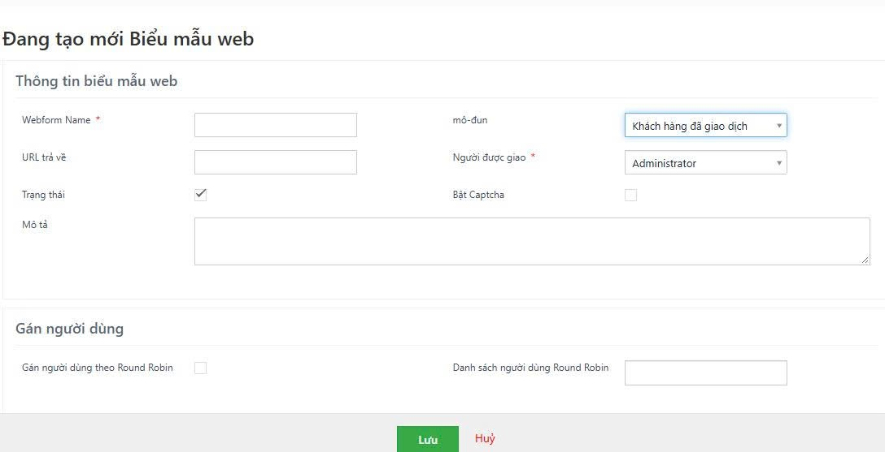

# Hướng dẫn sử dụng Biểu mẫu web (Webform)

## 1. Biểu mẫu web là gì?

Biểu mẫu web cho phép bạn tạo một form đăng ký (ví dụ "Đăng ký nhận tư vấn") rồi **nhúng vào website / landing page**. Khi khách hàng điền form và bấm gửi, CRM **tự động tạo một bản ghi** (Khách hàng tiềm năng, Khách hàng đã giao dịch, …) và giao cho nhân viên phụ trách — không phải nhập tay.

```
Khách điền form trên website  →  CRM tự tạo bản ghi  →  tự giao cho nhân viên  →  khách được chuyển tới trang "Cảm ơn"
```

**Ai dùng được:** chỉ tài khoản quản trị (Administrator) — chức năng nằm trong phần Cài đặt.

**Vào ở đâu:** biểu tượng bánh răng ⚙ (Cài đặt) → **Tự động hoá** → **Biểu mẫu web**. Bấm **Thêm biểu mẫu web** để tạo mới.

---

## 2. Tạo biểu mẫu mới



### Khối "Thông tin biểu mẫu web"

| Ô | Ý nghĩa | Nên điền gì |
|---|---|---|
| **Webform Name** (*) | Tên biểu mẫu, chỉ để quản trị viên phân biệt. **Không được trùng** với biểu mẫu khác (trùng sẽ báo "Tên biểu mẫu web đã tồn tại"). | Đặt theo nguồn, ví dụ `Landing page dự án A`, `Form chân trang website` |
| **mô-đun** | Bản ghi sẽ được tạo trong mô-đun nào khi khách gửi form. Chỉ có 6 mô-đun: Khách hàng tiềm năng, Khách hàng đã giao dịch, Chủ Đầu Tư, Đặt cọc - Giữ chỗ, Vé (phiếu hỗ trợ), Nhà cung cấp. | **Khách hàng tiềm năng** cho form đăng ký tư vấn. Chọn mô-đun **trước** rồi mới cấu hình trường (đổi mô-đun sẽ tải lại danh sách trường). |
| **URL trả về** | Trang website mà khách được chuyển tới **sau khi gửi form**. | Trang cảm ơn của bạn, ví dụ `https://tenmien.vn/cam-on`. Xem mục 5. |
| **Người được giao** (*) | Người (hoặc nhóm) sẽ sở hữu bản ghi vừa tạo. | Chọn nhân viên/nhóm tiếp nhận. Bị bỏ qua nếu bật Round Robin ở dưới. |
| **Trạng thái** | Bật = form đang hoạt động. Tắt = form ngừng nhận dữ liệu. | Để bật. Muốn tạm ngưng chiến dịch thì bỏ chọn thay vì xoá. |
| **Bật Captcha** | Yêu cầu khách giải captcha trước khi gửi. | **Không bật** — xem mục 8. |
| **Mô tả** | Ghi chú nội bộ. | Ghi mục đích, trang nào đang nhúng form. |

### Khối "Gán người dùng" (Round Robin)

Dùng khi muốn **chia đều lead cho nhiều nhân viên theo vòng**:

1. Tick **Gán người dùng theo Round Robin**.
2. Ở **Danh sách người dùng Round Robin**, chọn các nhân viên tham gia.

Hệ thống giao lần lượt theo thứ tự trong danh sách: lead 1 → người A, lead 2 → người B, lead 3 → người C, lead 4 → quay lại người A… Khi bật, ô **Người được giao** không còn tác dụng.

---

## 3. Chọn các trường trong form

Sau khi chọn mô-đun, phía dưới xuất hiện bảng **"… Thông tin trường"** quyết định form có những ô nhập nào.

- **Thêm trường:** bấm vào ô chọn và chọn thêm trường muốn đưa vào form. Các trường **bắt buộc của mô-đun luôn có sẵn** và không bỏ được (với Khách hàng tiềm năng: *Họ* và *Điện thoại chính*).
- **Kéo thả** các thẻ trong ô chọn để đổi thứ tự hiển thị, rồi bấm **Lưu thứ tự trường**.
- Bấm dấu ✕ ở cuối dòng để bỏ một trường khỏi form.

Mỗi dòng trong bảng có các cột:

| Cột | Ý nghĩa |
|---|---|
| **Bắt buộc** | Khách phải điền mới gửi được. Trường bắt buộc của hệ thống đã được tick sẵn, không bỏ được. |
| **Ẩn** | Ô không hiện cho khách, nhưng vẫn gửi một giá trị cố định về CRM (dùng cùng **Giá trị ghi đè**). |
| **Tên trường** | Tên trường trong CRM. |
| **Giá trị ghi đè** | Giá trị **mặc định/cố định**. Có giá trị này thì CRM luôn dùng nó, bất kể khách nhập gì. |
| **Trường tham chiếu biểu mẫu web** | Tên kỹ thuật của ô trong mã HTML — dành cho người làm website. |

**Mẹo hay dùng — gắn nguồn/dự án mà khách không nhìn thấy:** thêm trường *Nguồn khách hàng* (hoặc trường dự án), chọn **Giá trị ghi đè** = `Website`, tick **Ẩn**. Mọi lead từ form này sẽ tự mang nhãn đó.

**Ràng buộc hệ thống sẽ báo lỗi:**
- Trường bắt buộc mà **không có giá trị ghi đè** thì không được tick Ẩn (khách sẽ không điền được).
- Trường tham chiếu (chọn bản ghi khác) không được để Bắt buộc nếu không có giá trị ghi đè.

### Cho khách tải tệp lên (nếu có)

Với mô-đun có liên kết Tài liệu (Documents), có thêm khối **Tải lên tài liệu**: bấm **Trường tải lên tệp**, đặt *Tiêu đề tài liệu* và tick *Bắt buộc* nếu cần. Mỗi tệp khách gửi sẽ thành một **Tài liệu** gắn vào bản ghi vừa tạo. Tối đa **5 trường tệp**, tổng dung lượng mỗi lần gửi tối đa **50 MB**.

Cuối cùng bấm **Lưu** (nút xanh, góc dưới giữa). **Huỷ** để bỏ.

---

## 4. Lấy mã nhúng vào website

1. Vào danh sách Biểu mẫu web, ở dòng của form bấm biểu tượng **Hiển thị biểu mẫu** (hình bức tranh) — hoặc mở chi tiết biểu mẫu rồi bấm **Hiển thị biểu mẫu**.
2. Bấm **Sao chép vào clipboard** để copy toàn bộ mã HTML.
3. Gửi cho người làm website dán vào trang cần hiện form.

Lưu ý khi dán mã:
- **Giữ nguyên** các ô ẩn `publicid` và `urlencodeenable` và địa chỉ `action` (`…/modules/Webforms/capture.php`). Sửa/xoá là form ngừng hoạt động.
- Mã được tạo sẵn ở dạng bảng thô, nút gửi là chữ "Submit". Người làm website có thể chỉnh giao diện, đổi chữ nút, **miễn là giữ nguyên thuộc tính `name` của các ô nhập**.
- Mỗi lần **sửa danh sách trường** của biểu mẫu, phải **lấy lại mã** và cập nhật lên website.
- Địa chỉ `action` lấy từ `site_URL` trong `config.inc.php`. Website bên ngoài phải truy cập được địa chỉ này (trên server thật phải là tên miền CRM công khai, không phải `localhost`).

---

## 5. Khi khách bấm gửi, chuyện gì xảy ra?

1. CRM kiểm tra biểu mẫu đang **bật** và các trường bắt buộc đã có dữ liệu.
2. Tạo bản ghi mới trong mô-đun đã chọn (người tạo là tài khoản admin), có đánh dấu nguồn tạo là **Webform**.
3. Gán người phụ trách (theo **Người được giao** hoặc **Round Robin**).
4. Tạo Tài liệu nếu khách có tải tệp.
5. Phản hồi cho khách:
   - Có **URL trả về** → chuyển hướng tới URL đó, kèm `?success=ok` khi thành công hoặc `?error=<thông báo lỗi>` khi thất bại (trang cảm ơn có thể đọc tham số này để hiển thị đúng thông báo).
   - **Để trống URL trả về** → khách thấy một dòng chữ thô `{"success":true,"result":"ok"}`. Vì vậy **luôn nên điền URL trả về**.

---

## 6. Ví dụ: form "Đăng ký tư vấn" cho một dự án

| Mục | Giá trị |
|---|---|
| Webform Name | `Landing page dự án A` |
| mô-đun | Khách hàng tiềm năng |
| URL trả về | `https://tenmien.vn/cam-on` |
| Trạng thái | Bật |
| Round Robin | Bật, danh sách: 3 nhân viên sale của dự án A |
| Trường | *Họ* (bắt buộc), *Điện thoại chính* (bắt buộc), *Email*, *Nhu cầu* (tuỳ chọn) |
| Trường ẩn | *Nguồn* = `Website` (Ẩn + Giá trị ghi đè) |

Sau khi lưu: **Hiển thị biểu mẫu** → sao chép mã → gửi người làm website.

**Kiểm tra trước khi chạy thật:** điền thử một lần trên trang đã nhúng, vào mô-đun Khách hàng tiềm năng xem bản ghi có xuất hiện, đúng người phụ trách, đúng nguồn. Sau đó **xoá bản ghi thử**.

---

## 7. Quản lý biểu mẫu đã tạo

Trong danh sách Biểu mẫu web, mỗi dòng có các thao tác:

| Thao tác | Dùng để |
|---|---|
| **Hiển thị biểu mẫu** | Xem/sao chép mã HTML nhúng |
| **Sửa** | Đổi người nhận, trường, URL trả về, bật/tắt… |
| **Xoá** | Xoá hẳn biểu mẫu. Form đã nhúng trên website sẽ không còn nhận được dữ liệu. Các bản ghi đã tạo **không** bị xoá. |

Muốn ngừng tạm thời → **Sửa** và bỏ tick **Trạng thái**.

---

## 8. Lưu ý và lỗi thường gặp

| Hiện tượng | Nguyên nhân / cách xử lý |
|---|---|
| Khách gửi nhưng không có bản ghi | Biểu mẫu đang **tắt**; hoặc thiếu trường bắt buộc; hoặc website đã sửa/xoá ô `publicid`, đổi `name` của ô nhập. Lấy lại mã mới ở **Hiển thị biểu mẫu**. |
| Khách thấy chữ `{"success":true…}` | Chưa điền **URL trả về**. |
| Báo "Required fields not filled" | Một trường bắt buộc không được gửi lên (tên ô sai hoặc bị xoá khỏi HTML). |
| Gửi trùng, không tạo được bản ghi | Mô-đun đang bật **chống trùng lặp** (ví dụ trùng số điện thoại). Bản ghi không được tạo và CRM gửi email báo cho quản trị viên. |
| Lead đều rơi vào một người | Chưa bật Round Robin, hoặc danh sách Round Robin chỉ có một người. |
| Không thấy mô-đun trong ô chọn / báo "Bật module đích cho biểu mẫu web" | Mô-đun đó đang bị tắt trong Quản lý mô-đun. Chỉ 6 mô-đun nói ở mục 2 mới dùng được. |
| Đổi mô-đun xong mất cấu hình trường | Đúng như thiết kế — chọn mô-đun trước, cấu hình trường sau. |
| Mô-đun **Đặt cọc - Giữ chỗ** | Có nhiều trường bắt buộc (Dự Án, Mã nền, Ngày hết hạn, Giai đoạn…) nên **không phù hợp** cho form công khai. Dùng Khách hàng tiềm năng. |

**Về Captcha (đừng bật):** captcha tích hợp sẵn trong CRM dùng reCAPTCHA đời đầu (v1) và khoá cố định trong mã nguồn. Google đã ngừng v1 từ 2018 nên rất có thể không hiển thị được, làm khách không gửi được form (chưa kiểm chứng trên môi trường này). Nếu cần chống spam, hãy xử lý ở phía website (reCAPTCHA v3, ô bẫy ẩn…) rồi mới cho form gửi sang CRM.

**Về bảo mật:** `publicid` trong mã nhúng là "chìa khoá" của form — ai có nó đều gửi dữ liệu vào CRM được. Vì thế không nên bật form có trường quá nhạy cảm, và nên dọn bản ghi rác định kỳ.
