# Hướng dẫn sử dụng module Emails

Tài liệu mô tả **chức năng chính** của module Emails trong CRM và cách dùng từng chức năng. Ảnh chụp từ lần **chạy thật** ngày 05/10/2026 trên bản 7.4 (code đã có các bản sửa mới nhất), dùng dữ liệu mẫu và một máy chủ SMTP thử nghiệm — **không có email nào gửi tới khách thật**. Cách thao tác trên production giống hệt, nhưng production cần được cấu hình máy chủ gửi trước (mục 3).

**Mục lục:** 1. Module Emails là gì · 2. Chức năng chính · 3. Chuẩn bị (admin) · 4. Tìm chức năng ở đâu · 5. Mẫu email · 6. Gửi email cho một khách · 7. Xem lịch sử email · 8. Gửi hàng loạt · 9. Khách từ chối nhận email · 10. Bản nháp · 11. Báo cáo Email Reports · 12. Trình quản lý thư · 13. Quyền sử dụng · 14. Lưu ý và hạn chế đã biết

---

## 1. Module Emails là gì?

Module Emails giúp nhân viên **gửi email cho khách ngay từ hồ sơ khách trong CRM** và **tự lưu lại mọi email đã gửi** vào hồ sơ đó. Nhờ vậy cả nhóm biết khách đã được gửi gì, lúc nào, bởi ai — không phải tìm trong hộp thư cá nhân của từng người.

```
Hồ sơ khách (KH tiềm năng / KH đã giao dịch …)
   → bấm "Gửi Email" → soạn thư (hoặc chọn mẫu có sẵn) → Gửi
   → CRM gửi qua máy chủ SMTP của công ty
   → thư được lưu ở tab "Email" của hồ sơ khách
```

Module này **không phải hộp thư** để đọc thư đến. Việc đọc thư đến do *Trình quản lý thư* đảm nhiệm (mục 12). Các email **tự động** (ví dụ chúc mừng sinh nhật) do *Quy trình làm việc (workflow)* gửi, cũng được ghi nhận vào module này.

## 2. Chức năng chính

| # | Chức năng | Dùng để | Mục |
|---|---|---|---|
| 1 | **Gửi email từ hồ sơ khách** | Gửi 1 email cho 1 khách, có Cc/Bcc, đính kèm, chữ ký | 6 |
| 2 | **Mẫu email** | Soạn sẵn nội dung có biến tự điền tên, số điện thoại khách | 5 |
| 3 | **Lịch sử email** | Xem lại mọi email đã gửi/nháp ngay trong hồ sơ khách; Trả lời / Chuyển tiếp / In | 7 |
| 4 | **Gửi hàng loạt** | Chọn nhiều khách trong danh sách rồi gửi một lượt, mỗi người một thư riêng | 8 |
| 5 | **Từ chối nhận email** | Đánh dấu khách không muốn nhận → CRM tự bỏ qua khi gửi hàng loạt | 9 |
| 6 | **Bản nháp** | Lưu email chưa gửi để làm tiếp sau | 10 |
| 7 | **Báo cáo Email Reports** | Thống kê khách đã mở email (cần bật theo dõi) | 11 |
| 8 | **Trình quản lý thư** | Đọc thư đến, tạo công việc/phiếu từ thư (cần IMAP) | 12 |

---

## 3. Chuẩn bị: cấu hình máy chủ gửi (admin, làm một lần)

> ⚠️ **Production hiện chưa cấu hình máy chủ gửi** (cả bản cũ và mới đều chưa từng cấu hình). Chưa cấu hình thì CRM **không gửi được email**.

Cài đặt (⚙) → **Cấu hình** → **Máy chủ gửi**:


| Ô | Điền gì |
|---|---|
| Loại máy chủ | Chọn nhanh Gmail / Yahoo / Office365, hoặc để trống nếu dùng máy chủ riêng |
| Tên máy chủ | Địa chỉ SMTP, kèm cổng nếu cần (vd. `smtp.congty.vn:587`) |
| Tên người dùng, Mật khẩu | Tài khoản SMTP; bật **Yêu cầu xác thực** nếu máy chủ đòi |
| Email người gửi | Địa chỉ hiện ở dòng "Từ" của thư khách nhận. Để trống thì dùng email của người đang gửi |

Bấm **Lưu**: CRM **tự gửi một thư kiểm tra** tới email của bạn ("Test mail about the mail server configuration"). Nhận được thư là cấu hình đúng.

## 4. Tìm chức năng ở đâu?

- **Nút "Gửi Email"**: trong trang chi tiết của khách, và trong menu **Thêm** ở trang danh sách (khi đã tick khách).
- **Mẫu email**: bấm biểu tượng ☰ (góc trên trái) → **CÔNG CỤ** → **Mẫu email**.
- **Trình quản lý thư**: cũng trong menu ☰, ngay dưới các nhóm chức năng.
- **Lịch sử email**: tab có biểu tượng phong bì ✉ trong hồ sơ khách.
- **Báo cáo email**: **Báo cáo** → thư mục **Báo cáo email**.

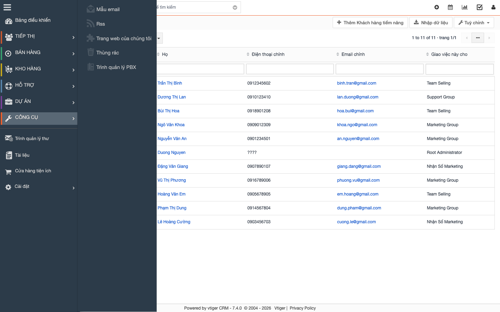

---

## 5. Mẫu email

Mẫu email là nội dung soạn sẵn dùng đi dùng lại. Điểm hay nhất là **biến**: CRM tự thay bằng thông tin của từng khách khi gửi.

**Xem các mẫu:** ☰ → CÔNG CỤ → **Mẫu email**. CRM có sẵn các mẫu của vtiger (đều bằng **tiếng Anh**); nên tạo mẫu tiếng Việt riêng.

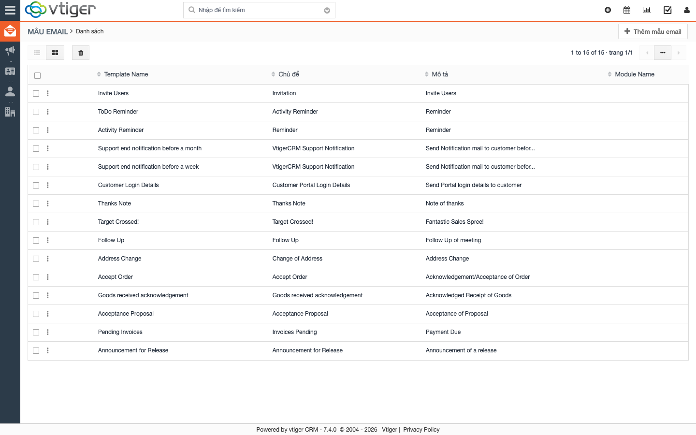

**Tạo mẫu mới:** bấm **Thêm mẫu email**.

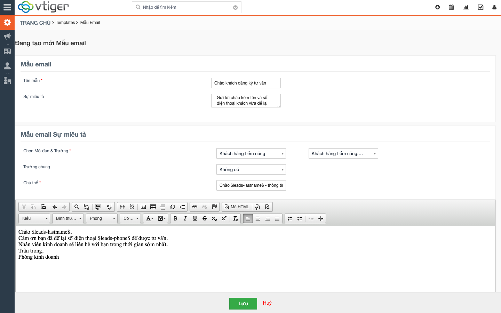

| Ô | Ý nghĩa |
|---|---|
| Tên mẫu (*) | Tên để nhân viên chọn khi gửi |
| Sự miêu tả | Ghi chú về mục đích mẫu |
| Chọn Mô-đun & Trường | Chọn mô-đun mẫu áp dụng (vd. Khách hàng tiềm năng) và danh sách trường để lấy biến |
| Chủ thể (*) | Tiêu đề thư — cũng dùng được biến |
| Khung soạn thảo | Nội dung thư; có thanh định dạng (đậm, nghiêng, màu, bảng, ảnh, liên kết, mã HTML…) |

**Biến** có dạng `$mô-đun-trường$`, ví dụ:

| Biến | Thay bằng |
|---|---|
| `$leads-lastname$` | Tên khách hàng tiềm năng |
| `$leads-phone$` | Số điện thoại khách hàng tiềm năng |
| `$contacts-lastname$` | Tên khách hàng đã giao dịch |

> **Quan trọng:** biến phải đúng mô-đun. Mẫu dùng `$leads-…$` thì chỉ gửi cho *Khách hàng tiềm năng*; gửi cho khách thuộc mô-đun khác thì biến **không được thay**. CRM có nhắc điều này khi bạn chọn mẫu.

Bấm **Lưu** để xem chi tiết mẫu:

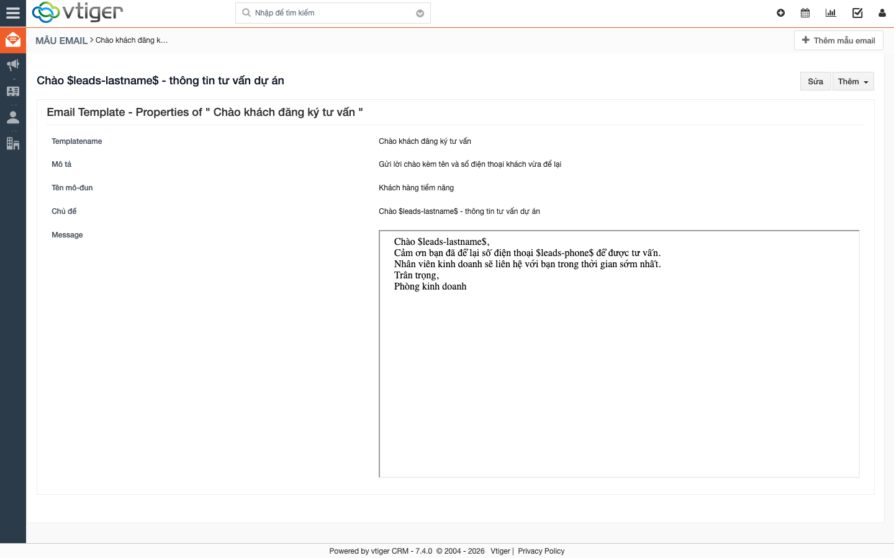

---

## 6. Gửi email cho một khách

**Bước 1 — Mở hồ sơ khách** (vd. *Khách hàng tiềm năng* → bấm tên khách) rồi bấm **Gửi Email**. Khách cần có *Email chính*.

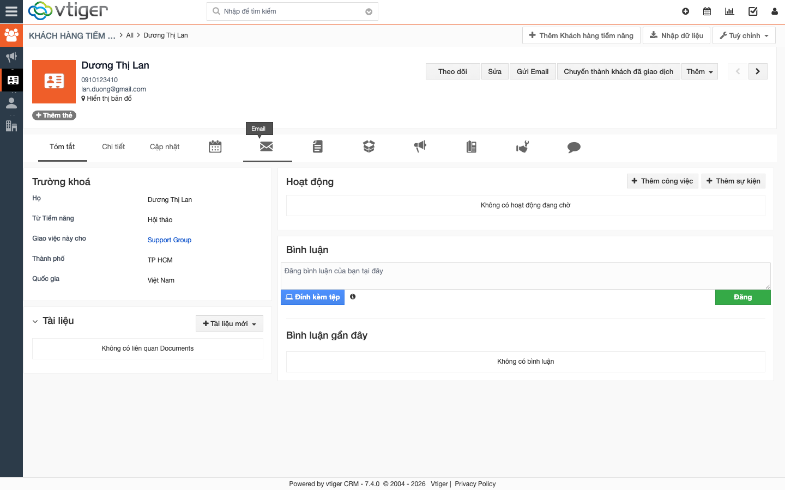

**Bước 2 — Hộp "Soạn email"** mở ra, ô **ĐẾN** tự điền email khách.

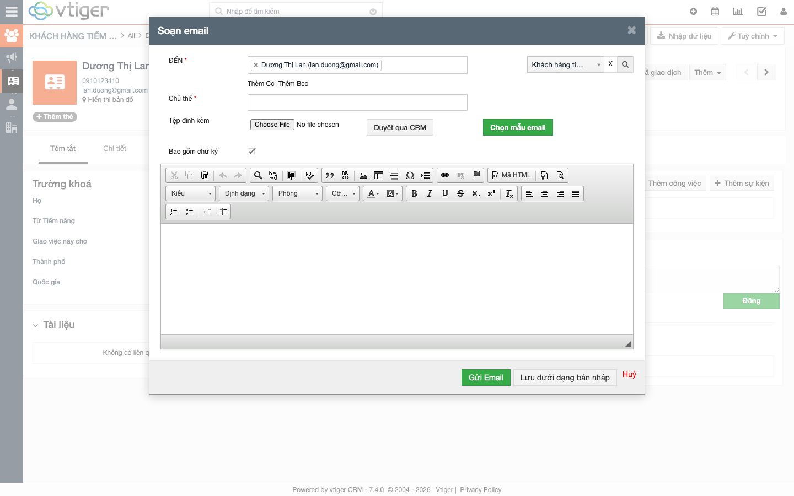

| Ô | Cách dùng |
|---|---|
| **ĐẾN** | Đã có người nhận. Muốn thêm người khác: gõ thẳng địa chỉ email vào ô rồi nhấn **Enter** (đã thử). Bên phải còn có biểu tượng kính lúp để chọn người nhận từ CRM (chưa thử) |
| **Thêm Cc / Thêm Bcc** | Hiện ô Cc/Bcc; nhập nhiều địa chỉ cách nhau bằng dấu phẩy |
| **Chủ thể** | Tiêu đề thư (bắt buộc) |
| **Tệp đính kèm** | *Choose File* chọn tệp từ máy, hoặc *Duyệt qua CRM* chọn từ mô-đun Tài liệu |
| **Chọn mẫu email** | Điền sẵn chủ thể và nội dung từ một mẫu |
| **Bao gồm chữ ký** | Tick để chèn chữ ký cá nhân của bạn vào cuối thư |
| **Khung soạn thảo** | Gõ nội dung như trong Word |

**Bước 3 — (Tuỳ chọn) Chọn mẫu email.** Bấm **Chọn mẫu email** → bấm vào dòng mẫu muốn dùng.


Sau khi chọn, chủ thể và nội dung được điền sẵn; bạn vẫn **sửa/ thêm** tuỳ ý. Dưới đây là ví dụ đã thêm Cc và gõ thêm dòng "P/S":

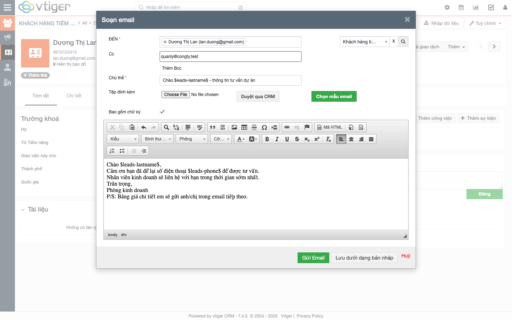

> Trong ô soạn, biến vẫn hiện nguyên dạng (`$leads-lastname$`). **Khi gửi mới được thay bằng thông tin thật** của khách.

**Bước 4 — Bấm Gửi Email.** Hộp thoại **"Đã gửi thư thành công"** hiện ra.

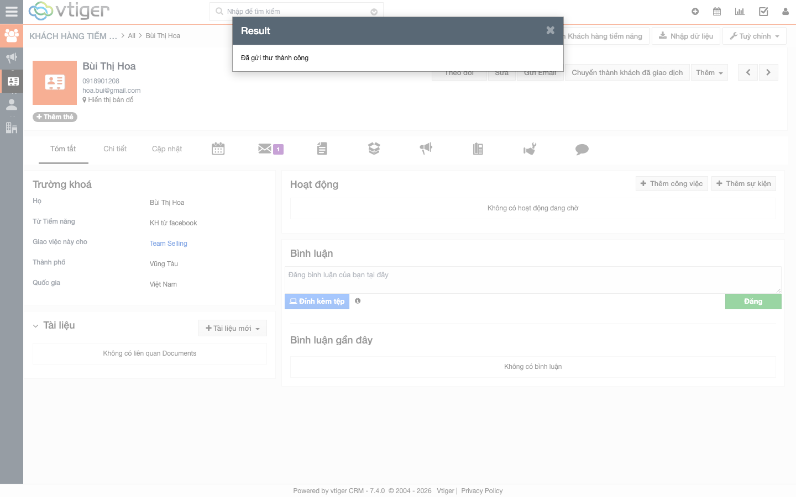

**Khách nhận được** thư như sau (đây là thư thật bắt được ở máy chủ thử nghiệm): biến đã được thay đúng tên và số điện thoại, có người Cc, và khi khách bấm *Trả lời* thì thư về email của nhân viên gửi.

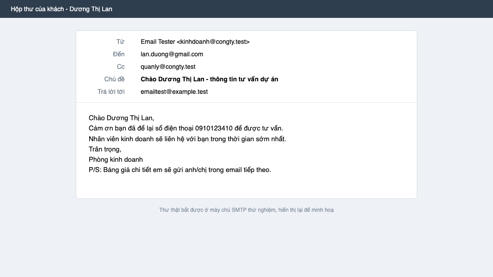

Lưu ý:
- Khách **không có email**: hộp soạn vẫn mở nhưng ô ĐẾN trống, phải nhập tay.
- Thư gửi đi có **Từ** là *Email người gửi* đã cấu hình ở mục 3 và **Reply-To** là email của nhân viên.

---

## 7. Xem lịch sử email

Mọi email gửi từ CRM được lưu ở tab **Email** (biểu tượng phong bì, kèm số lượng) trong hồ sơ khách.

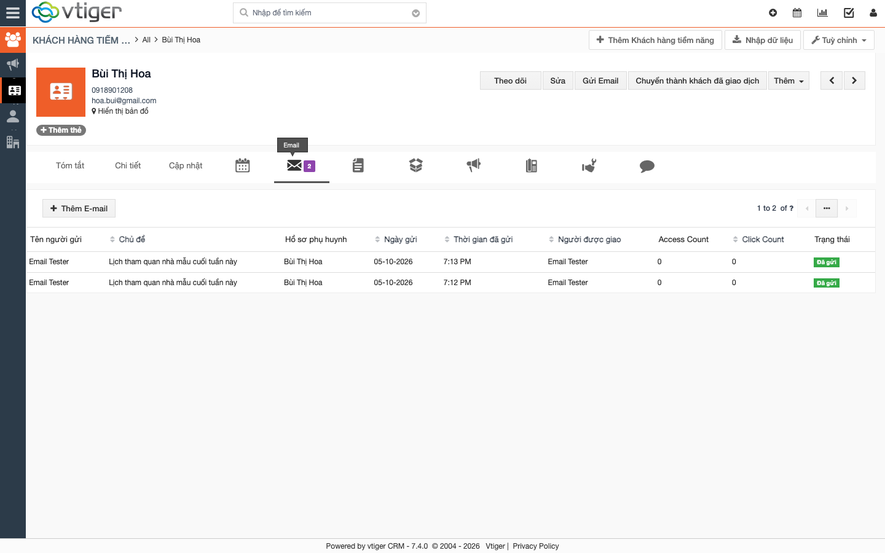

| Cột | Ý nghĩa |
|---|---|
| Tên người gửi | Nhân viên đã gửi |
| Chủ đề | Tiêu đề thư |
| Hồ sơ phụ huynh | Thực chất là **hồ sơ liên quan** — khách mà thư thuộc về (tên chưa dịch chuẩn) |
| Ngày gửi, Thời gian đã gửi | Lúc gửi |
| Access Count / Click Count | Số lần khách **mở** thư / **bấm liên kết** (luôn là 0 nếu chưa bật theo dõi, mục 11) |
| Trạng thái | **Đã gửi** hoặc **Nháp** |

**Bấm vào chủ đề** để xem nội dung thư. Có 3 nút: **Trả lời**, **Phía trước** (nghĩa là *Chuyển tiếp*, tên chưa dịch chuẩn) và **In**.

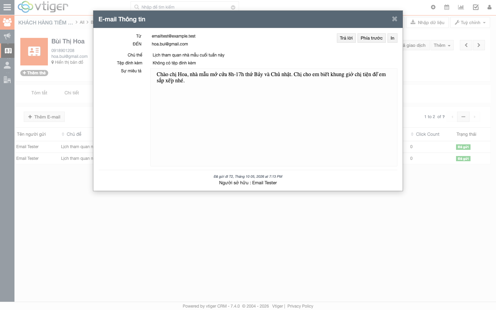

> Cột *Chủ đề* của thư gửi bằng mẫu vẫn hiện **dạng biến** (`Chào $leads-lastname$ …`) vì CRM lưu bản gốc; thư thực tế khách nhận đã được thay tên (xem ảnh ở mục 6).

---

## 8. Gửi hàng loạt

Dùng khi cần gửi cùng một nội dung cho nhiều khách (thông báo mở bán, mời tham quan…).

**Bước 1 — Tick các khách** trong danh sách (vd. *Khách hàng tiềm năng*).

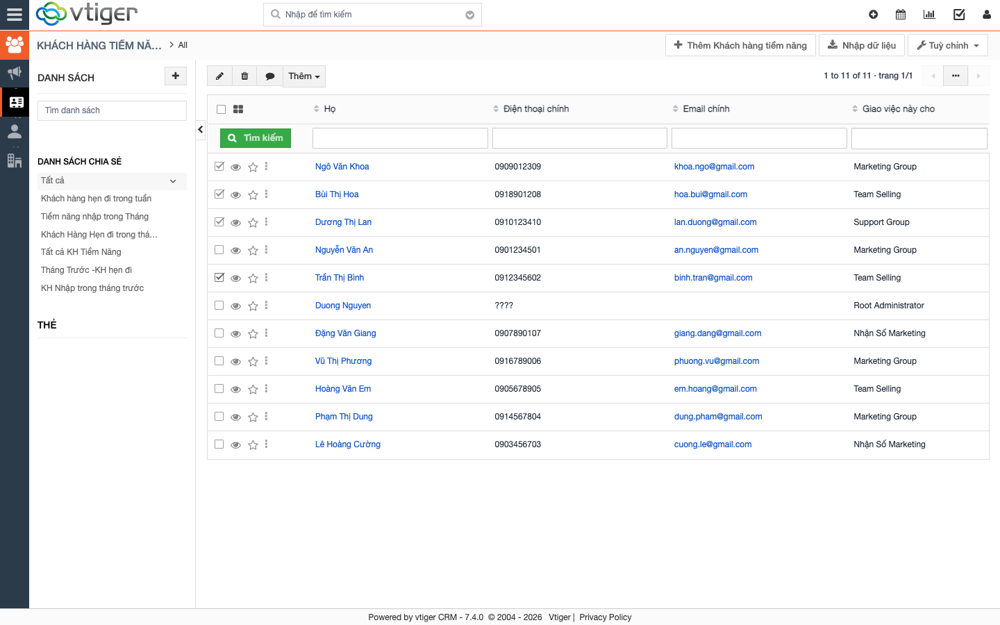

**Bước 2 — Bấm Thêm → Gửi Email.**


**Bước 3 — Soạn thư** (hoặc chọn mẫu) rồi **Gửi Email**. Ô ĐẾN liệt kê tất cả người nhận.

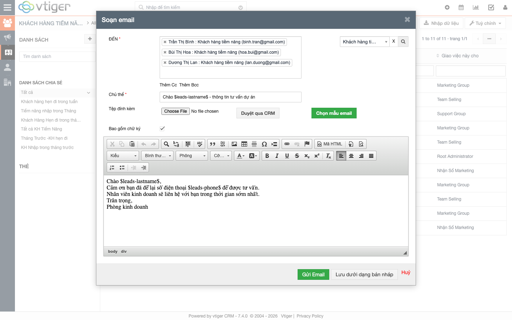

Ví dụ này tick **4 khách** nhưng hộp soạn chỉ còn **3 người nhận** — khách thứ 4 đã đánh dấu *Từ chối nhận email* (mục 9) nên CRM tự loại.

CRM gửi **một thư riêng cho từng người**:
- mỗi người chỉ thấy địa chỉ của chính mình (không lộ email của người khác);
- chủ đề và nội dung (nếu dùng mẫu) mang **đúng tên, số điện thoại của người đó**;
- Cc/Bcc (nếu có) được gắn vào **mỗi** thư, nên người được Cc sẽ nhận N bản khi gửi cho N khách.

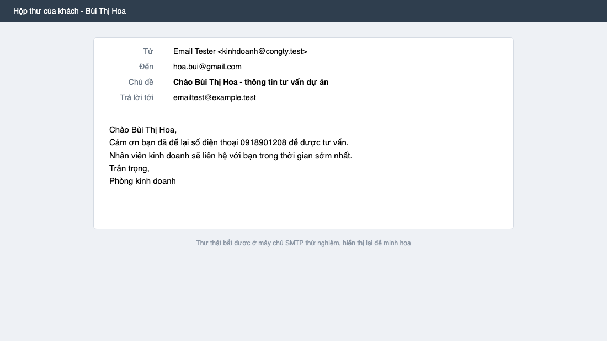

## 9. Khách từ chối nhận email

Trong hồ sơ khách (bấm **Sửa**) có ô **Từ chối nhận email**. Tick ô này nếu khách yêu cầu không gửi email nữa.

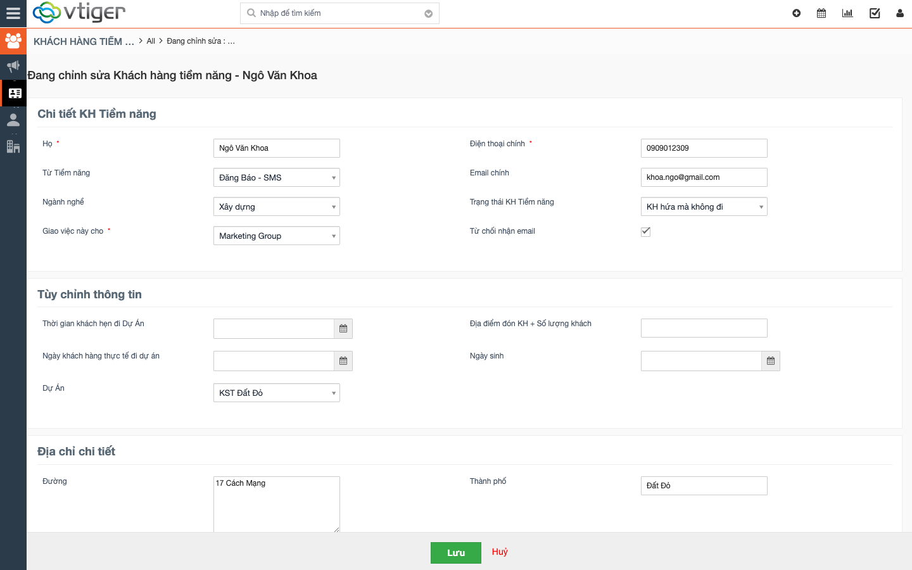

Khách đã tick sẽ **tự động bị loại** khỏi danh sách người nhận: khi gửi hàng loạt họ không có trong ô ĐẾN, và khi gửi riêng từ hồ sơ của họ thì hộp soạn mở ra nhưng **ô ĐẾN để trống** (đã kiểm tra).

## 10. Bản nháp

Đang soạn dở? Bấm **Lưu dưới dạng bản nháp** trong hộp soạn: email **không gửi đi**, được lưu ở tab Email với trạng thái **Nháp**.


---

## 11. Báo cáo Email Reports

**Báo cáo** → thư mục **Báo cáo email** có 4 báo cáo mẫu: *Contacts / Leads / Accounts / Vendors Email Report*.

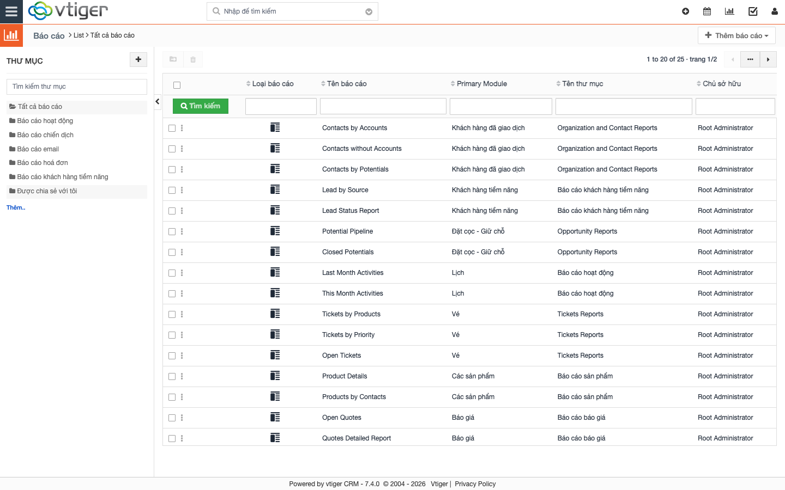

Mỗi báo cáo liệt kê **những khách đã mở email** (điều kiện: *Email Access Count* khác rỗng) kèm chủ đề thư và số lượt mở:

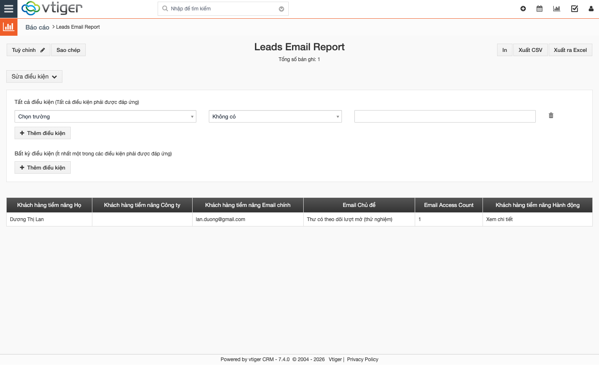

Cần biết:
- ✅ *Contacts* và *Leads Email Report* mở được. *Accounts* và *Vendors Email Report* báo "Bị từ chối quyền" vì hai mô-đun Accounts/Vendors đang **tắt** trên production.
- ⚠️ **Báo cáo trống (0 bản ghi) nếu chưa bật theo dõi lượt mở**. Theo dõi chèn một ảnh ẩn và đổi liên kết trong thư để biết khách mở/bấm. Hiện **chưa bật** và không bật được từ giao diện (cần thêm `$email_tracking = 'Yes';` vào `config.inc.php`). **Chưa nên bật**: liên kết theo dõi có dạng `…//shorturl.php` (2 dấu `/`), trên server hiện tại sẽ dẫn về trang đăng nhập, làm hỏng cả liên kết trong email.

## 12. Trình quản lý thư

Menu ☰ → **Trình quản lý thư**: ứng dụng email tích hợp, cho phép **đọc thư đến** ngay trong CRM và tạo khách hàng, phiếu hỗ trợ, tác vụ… từ chính thư nhận được.

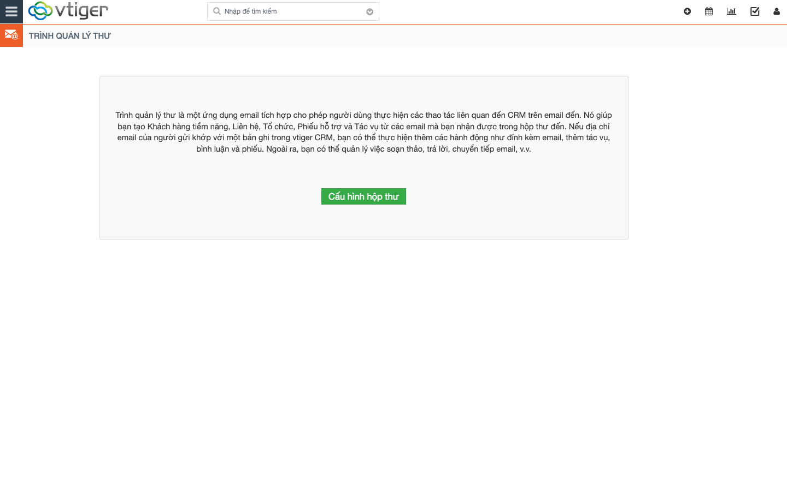

Cần bấm **Cấu hình hộp thư** và có máy chủ **IMAP**. Máy chủ production hiện **chưa hỗ trợ IMAP** nên chức năng này **chưa dùng được**.

## 13. Quyền sử dụng

- Hồ sơ (profile) có quyền mô-đun **Emails** mới gửi được. Ngày 05/10/2026 đã bật mô-đun Emails và cấp quyền cho cả 52 hồ sơ trên production.
- Đã kiểm tra bằng tài khoản **nhân viên thường** (vai trò Sales Person): thấy nút *Gửi Email*, tab Email, menu gửi hàng loạt và **gửi được** (không cần là admin).

## 14. Lưu ý và hạn chế đã biết

| Vấn đề | Chi tiết |
|---|---|
| Chưa có máy chủ gửi trên production | Phải cấu hình theo mục 3 mới dùng được |
| Một số nhãn dịch chưa chuẩn | "Hồ sơ phụ huynh" (= hồ sơ liên quan), "Phía trước" (= Chuyển tiếp), "Access Count"/"Click Count", "Templatename"/"Message", tiêu đề hộp thoại "Result" còn tiếng Anh |
| Phần văn bản thuần của thư mất dấu tiếng Việt | Chỉ ảnh hưởng người xem thư ở chế độ văn bản thuần; bản HTML (hầu hết khách xem) đúng tiếng Việt |
| Theo dõi lượt mở chưa dùng được | Xem mục 11 |
| Mẫu mặc định bằng tiếng Anh | Nên tạo mẫu riêng (mục 5) |
| Chưa thử | Đính kèm tệp, chọn người nhận bằng kính lúp, nhận thư qua Trình quản lý thư, email tự động từ workflow, gửi cho Khách hàng đã giao dịch (cách làm giống Khách hàng tiềm năng) |

**Lịch sử sửa lỗi liên quan:** ngày 05/10/2026 đã sửa 2 lỗi nặng và triển khai lên production — (1) khung soạn nội dung email/mẫu email bị trống; (2) gửi hàng loạt chỉ tới người cuối danh sách.
