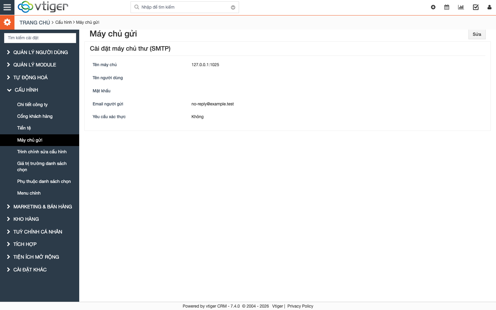
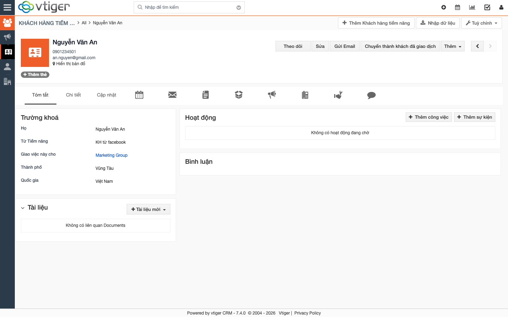
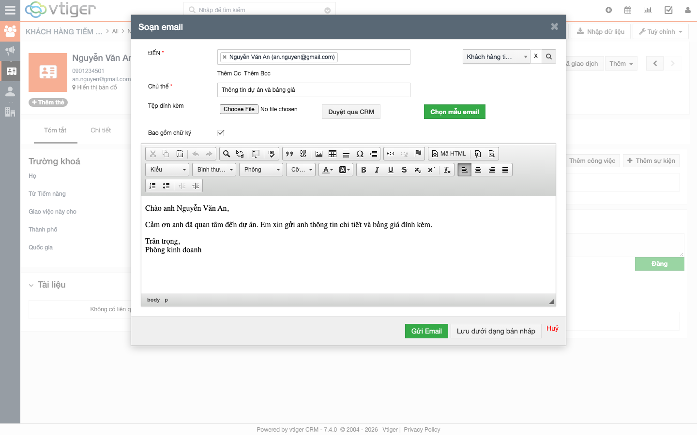
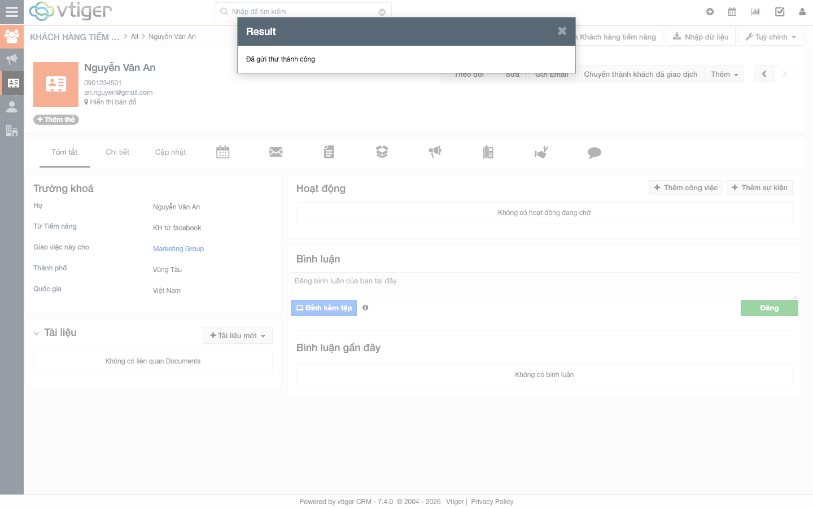
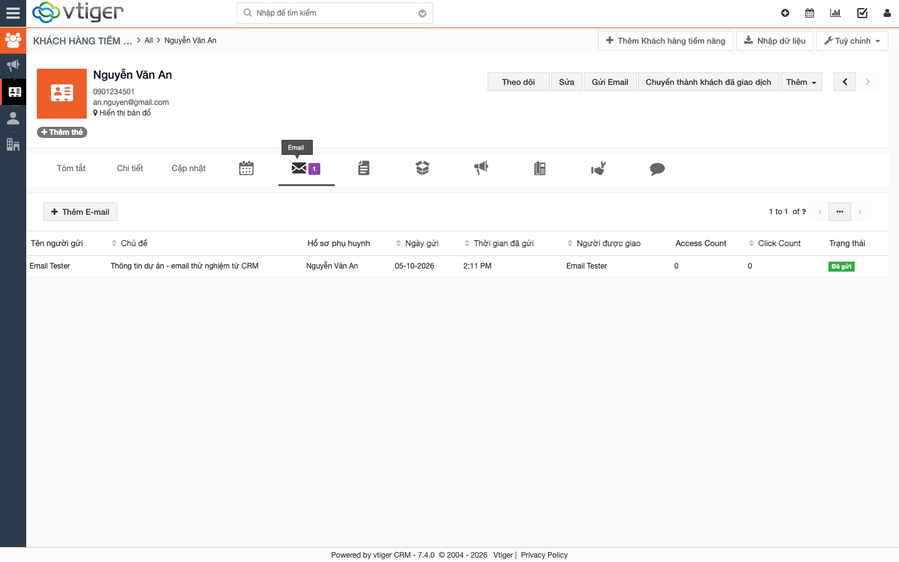
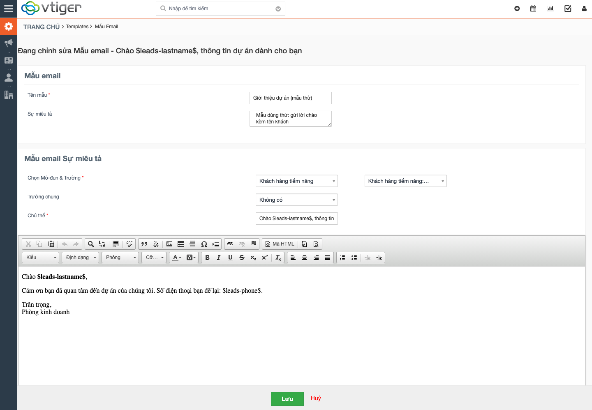
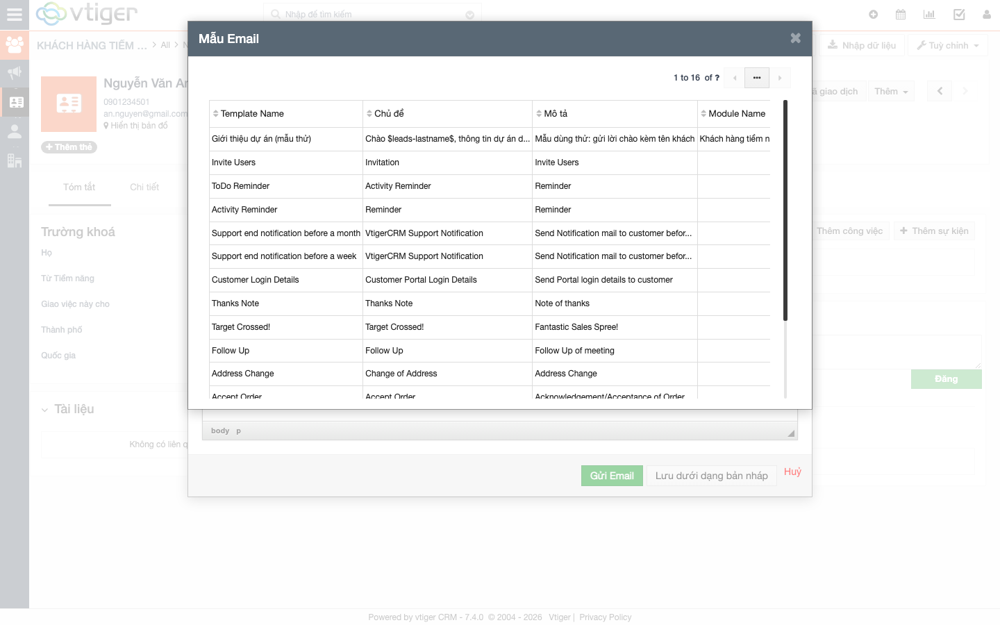
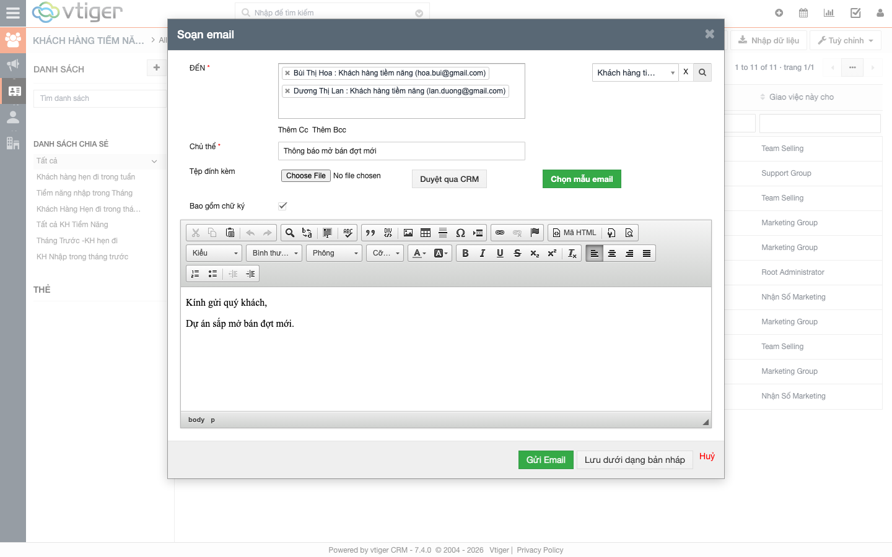
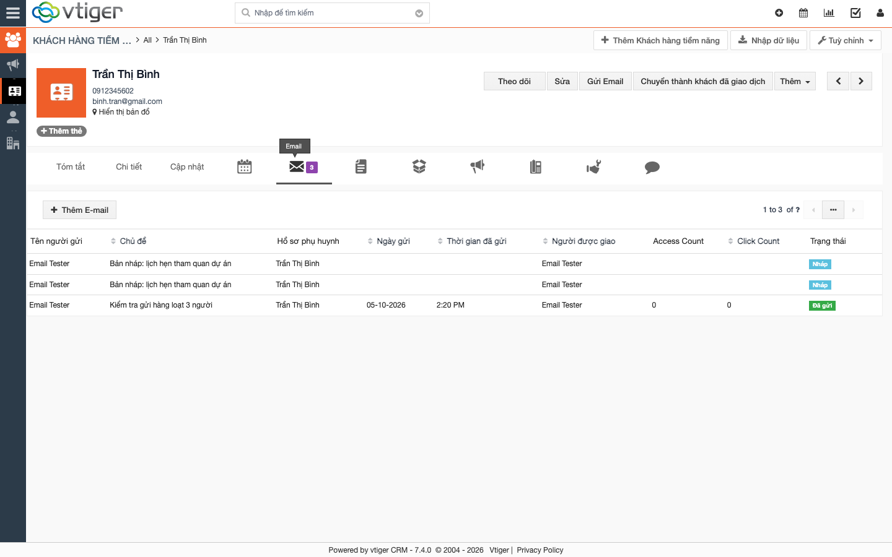

# Hướng dẫn module Emails (gửi email trong CRM)

> **Phạm vi:** hướng dẫn này viết sau khi test module Emails ngày 05/10/2026 trên **bản local** (dữ liệu mẫu, SMTP giả — không có email nào gửi ra ngoài). Ảnh chụp từ bản local. Mục 9 liệt kê các lỗi phát hiện khi test; **đọc mục này trước khi cho nhân viên dùng thật**.
>
> **Cập nhật cùng ngày:** hai lỗi nặng nhất (#1 không có ô soạn nội dung, #2 gửi hàng loạt chỉ tới người cuối) đã được sửa trong code và kiểm tra lại trên bản local; **production cần triển khai bản sửa**.

## 1. Module Emails là gì?

Emails **không phải hộp thư**. Đây là công cụ **gửi email từ chính hồ sơ khách hàng** và **lưu lại lịch sử** vào hồ sơ đó:

```
Mở hồ sơ khách (KH tiềm năng / KH đã giao dịch …)
   → bấm "Gửi Email" → soạn (hoặc chọn mẫu) → Gửi
   → CRM gửi qua máy chủ SMTP của công ty
   → email được lưu ở tab "Email" của hồ sơ + dùng cho báo cáo
```

Gồm các chức năng:

| Chức năng | Dùng để |
|---|---|
| Gửi email từ hồ sơ | Gửi 1 email cho 1 khách, có lưu lịch sử |
| Mẫu email (Email Templates) | Soạn sẵn nội dung, tự điền tên/SĐT khách |
| Gửi hàng loạt | Chọn nhiều khách trong danh sách rồi gửi một lượt |
| Từ chối nhận email | Đánh dấu khách không muốn nhận → CRM tự bỏ qua |
| Bản nháp | Lưu email chưa gửi |
| Báo cáo Email Reports | Thống kê khách đã **mở** email (cần bật theo dõi) |

**Không nhầm với:** *Trình quản lý thư (MailManager)* — đọc hộp thư đến qua IMAP (server production hiện không hỗ trợ IMAP nên chưa dùng được); và các email **workflow** tự động (vd. chúc mừng sinh nhật).

> Ngày 05/10/2026 module Emails đã được **bật lại** trên production (trước đó bị tắt từ bản cũ nên báo cáo Email Reports báo "Bị từ chối quyền").

## 2. Việc cần làm trước khi dùng: cấu hình máy chủ gửi (admin)

> ⚠️ **Production chưa cấu hình máy chủ gửi** (bảng cấu hình trống, bản cũ cũng vậy). Chưa cấu hình thì CRM **không gửi được email**.

Cài đặt (⚙) → **Cấu hình** → **Máy chủ gửi**:



| Ô | Điền gì |
|---|---|
| Tên máy chủ | Địa chỉ SMTP (vd. `smtp.gmail.com`, kèm cổng nếu cần). Có thể chọn nhanh Gmail/Yahoo/Office365 ở ô *Loại máy chủ* |
| Tên người dùng / Mật khẩu | Tài khoản SMTP, bật **Yêu cầu xác thực** nếu máy chủ đòi |
| Email người gửi | Địa chỉ hiện ở "From". Để trống thì dùng email của người đang gửi |

Khi bấm **Lưu**, CRM **tự gửi một thư kiểm tra** tới email của bạn ("Test mail about the mail server configuration") — nhận được thư là cấu hình đúng.

## 3. Gửi email cho một khách

1. Mở hồ sơ khách (vd. *Khách hàng tiềm năng* → bấm tên khách). Khách phải có **Email chính**.
2. Bấm **Gửi Email**.



3. Hộp **Soạn email** mở ra, ô **ĐẾN** tự điền email khách. Nhập **Chủ thể** và nội dung. Có thể **Thêm Cc / Thêm Bcc**, **đính kèm tệp** (từ máy hoặc *Duyệt qua CRM*), tick/bỏ **Bao gồm chữ ký**.



4. Bấm **Gửi Email**. Hộp thoại **"Đã gửi thư thành công"** hiện ra.



5. Email được lưu ở tab **Email** (biểu tượng phong bì, kèm số lượng) của hồ sơ, trạng thái **Đã gửi**:



Ghi chú:
- Khách **không có email**: hộp soạn vẫn mở nhưng ô ĐẾN trống, phải nhập tay.
- Thư gửi đi có **From** là "Tên người gửi" + *Email người gửi* đã cấu hình, và **Reply-To** là email của chính người gửi → khách bấm Trả lời sẽ về hộp thư của nhân viên.

## 4. Mẫu email (soạn một lần, dùng nhiều lần)

**Tạo mẫu:** menu **Công cụ → Mẫu email** (hoặc `Mẫu Email`) → **Thêm mẫu email**.



- **Chọn Mô-đun & Trường:** chọn mô-đun mẫu áp dụng (vd. Khách hàng tiềm năng) rồi chọn trường để chèn **biến** vào nội dung.
- Biến có dạng `$leads-lastname$` (tên), `$leads-phone$` (SĐT) — viết đúng theo mô-đun: KH tiềm năng dùng `$leads-…$`, KH đã giao dịch dùng `$contacts-…$`. **Biến sai mô-đun sẽ không được thay** (CRM cũng cảnh báo điều này khi bạn chọn mẫu).
- Biến dùng được ở cả **Chủ đề** lẫn **nội dung**.

**Dùng mẫu khi soạn email:** trong hộp Soạn email bấm **Chọn mẫu email** → chọn mẫu.



> Trong ô soạn, biến vẫn hiện dạng `$leads-lastname$`. **Khi gửi mới được thay thành giá trị thật** — đã kiểm tra: thư gửi đi có chủ đề "Chào Nguyễn Văn An, …" và nội dung có đúng số điện thoại khách.

Các mẫu mặc định của vtiger đều bằng **tiếng Anh** (Invite Users, Follow Up, Thanks Note …); nên tạo mẫu tiếng Việt riêng.

## 5. Gửi hàng loạt

Trong danh sách (vd. Khách hàng tiềm năng): tick các khách → bấm **Thêm** → **Gửi Email**.




CRM gửi **một thư riêng cho từng người nhận**: mỗi người chỉ thấy địa chỉ của chính mình, và biến mẫu (`$leads-lastname$`…) trong chủ đề lẫn nội dung được thay theo đúng người đó. Cc/Bcc (nếu có) được gắn vào **mỗi** thư.

> ✅ Đã sửa lỗi #2 ở mục 9 (trước đây chỉ người cuối danh sách nhận được thư). **Cần triển khai bản sửa lên production** mới có hiệu lực ở đó.

### Khách "Từ chối nhận email"

Trong hồ sơ khách có ô **Từ chối nhận email**. Tick ô này thì khách bị **tự động loại** khỏi danh sách người nhận khi gửi hàng loạt (đã kiểm tra: chọn 3 khách, 1 khách bị tick → ô ĐẾN chỉ còn 2 người).


## 6. Lưu bản nháp

Trong hộp Soạn email bấm **Lưu dưới dạng bản nháp**: email **không gửi đi**, được lưu ở tab Email với trạng thái **Nháp**.



## 7. Báo cáo Email Reports

Báo cáo → thư mục **Email Reports** có 4 báo cáo mẫu: Contacts / Leads / Accounts / Vendors Email Report.


- Mỗi báo cáo liệt kê **khách đã mở email** (điều kiện: *Email Access Count* khác rỗng) kèm chủ đề và số lượt mở.
- ✅ *Contacts* và *Leads Email Report* đã mở được (hết lỗi "Bị từ chối quyền"), đã kiểm tra với tài khoản quản trị.
- ⛔ *Accounts* và *Vendors Email Report* vẫn báo "Bị từ chối quyền" vì mô-đun Accounts/Vendors đang **tắt** trên production.
- ⚠️ **Hiện báo cáo luôn trống (0 bản ghi)** vì chức năng **theo dõi lượt mở email đang tắt** và không bật được từ giao diện — xem lỗi #3.

## 8. Quyền sử dụng

- Hồ sơ (profile) nào có quyền mô-đun **Emails** mới gửi được. Đã thêm quyền này cho cả 52 hồ sơ trên production.
- Đã kiểm tra thêm bằng tài khoản **nhân viên thường** (vai trò Sales Person): thấy nút **Gửi Email**, tab Email, menu gửi hàng loạt, và **gửi được email** (không cần là admin).
- Nhân viên không có quyền xuất dữ liệu thì không thấy "Xuất dữ liệu" trong menu — không liên quan Emails.

## 9. Lỗi phát hiện khi test

| # | Mức độ | Hiện tượng | Nguyên nhân | Đề xuất |
|---|---|---|---|---|
| 1 | ✅ Đã sửa | **Không có ô soạn nội dung email** (khung soạn trống; cũng không sửa được nội dung mẫu email) | Từ khi gộp JS thành 1 file (commit `c56d04af`), trình soạn thảo CKEditor không còn tìm được thư mục của nó (`CKEDITOR.basePath` thành `/`). Đã xác nhận: khai báo `CKEDITOR_BASEPATH` thì editor hiện bình thường. Production dùng cùng cơ chế gộp JS và không khai báo → **rất có thể lỗi y hệt** (chưa đăng nhập production để xem trực tiếp) | **Đã sửa:** khai báo `window.CKEDITOR_BASEPATH` trong [Header.tpl](../layouts/v7/modules/Vtiger/Header.tpl) trước bundle. Đã kiểm tra lại: editor `ready` ở hộp soạn email và trang sửa mẫu. Chờ triển khai production |
| 2 | ✅ Đã sửa | Gửi hàng loạt: CRM ghi "đã gửi cho N người", nhưng SMTP chỉ nhận **1 thư (người cuối)** | [Record.php:84-104](../modules/Emails/models/Record.php): biến `$emails` bị gán lại rỗng mỗi vòng lặp → chỉ giữ người nhận cuối. Là **lỗi có sẵn trong mã gốc vtiger 7.4.0** (file chỉ khác bản gốc 1 chữ `static`) | **Đã sửa:** `send()` trong [Record.php](../modules/Emails/models/Record.php) gửi một thư riêng cho từng người. Kiểm tra lại: chọn 3 khách → 3 thư riêng, mỗi thư chỉ gửi cho 1 người, chủ đề/nội dung mang đúng tên người đó. Chờ triển khai production |
| 3 | 🟠 TB | Báo cáo Email Reports luôn 0 dòng | Cần bật theo dõi email (`$email_tracking = 'Yes'` trong `config.inc.php`), màn *Trình chỉnh sửa cấu hình* của bản này **không có** tuỳ chọn này. Ngoài ra link theo dõi dạng `domain//shorturl.php` (2 dấu `/`) bị server PHP tích hợp trả về **trang đăng nhập** (đã thử trên production: `//shorturl.php` → trang đăng nhập 15 KB, `/shorturl.php` → đúng handler) → bật theo dõi thì **link trong email cũng hỏng** | **Đừng bật theo dõi** cho đến khi sửa đường dẫn `shorturl.php` |
| 4 | 🟠 TB | Production **chưa cấu hình máy chủ gửi** | Bảng cấu hình trống ở cả bản cũ và mới | Admin cấu hình theo mục 2 |
| 5 | 🟡 Thấp | Phần **văn bản thuần** (text/plain) của email bị mất dấu, vd. "Nguya>>n VAn An" | Hàm `convertToAscii` của vtiger cố ý chuyển sang ASCII. Phần HTML (cái hầu hết khách xem) **vẫn đúng tiếng Việt** | Giữ UTF-8 cho phần văn bản thuần |
| 6 | 🟡 Thấp | Còn chữ tiếng Anh/dịch sai | "Access Count", "Click Count" (cột tab Email); "Parent ID" dịch thành **"Hồ sơ phụ huynh"** (nên là "Liên quan đến"); cảnh báo "Please make sure that the template…" khi chọn mẫu; tiêu đề hộp thoại "Result"; nhãn "Templatename", "Message" ở chi tiết mẫu | Bổ sung bản dịch trong `languages/vi_vn/Emails.php` |

## 10. Cách đã test

- Môi trường: bản local (PHP 7.4, DB dev, dữ liệu mẫu), SMTP giả `127.0.0.1:1025` lưu thư ra file — **không gửi email thật**, không đụng dữ liệu khách production.
- Đã chạy: cấu hình máy chủ gửi; gửi 1 email; dùng mẫu có biến; gửi hàng loạt; khách từ chối nhận; bản nháp; khách không có email; báo cáo Email Reports (kể cả mô phỏng khách mở email); gửi bằng tài khoản nhân viên thường.
- Test lại sau khi sửa lỗi #1 và #2: editor tải đúng ở hộp soạn email và trang sửa mẫu (không dùng thủ thuật nào); gửi hàng loạt 3 khách → 3 thư riêng đúng người; ca khách + địa chỉ gõ tay + Cc → mỗi người một thư, Cc gắn vào mỗi thư (địa chỉ gõ tay không có bản ghi khách nên biến mẫu giữ nguyên).
- **Chưa test:** nhận email (MailManager, cần IMAP); email tự động từ workflow; đính kèm tệp; tài khoản nhân viên có hồ sơ tuỳ biến trên production.
